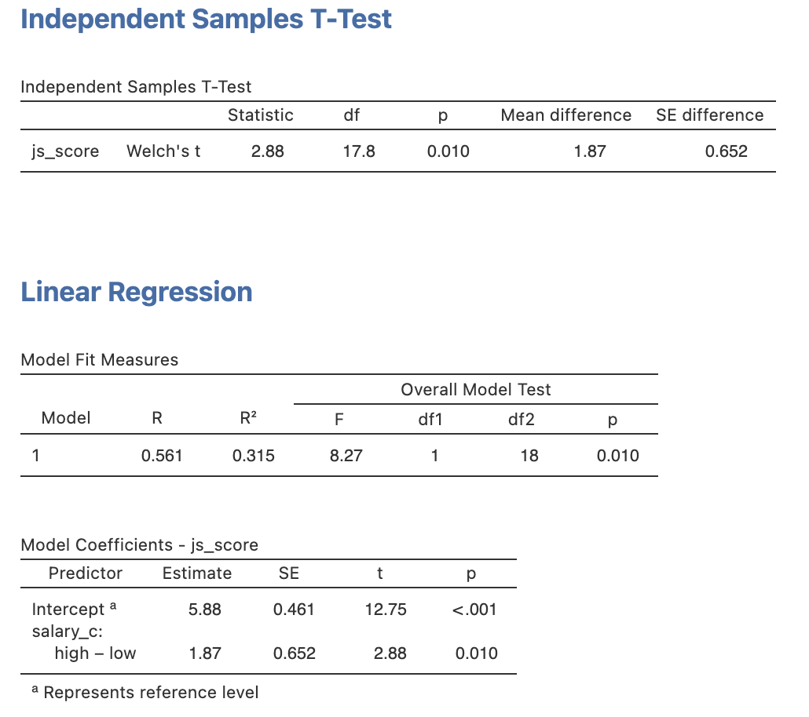
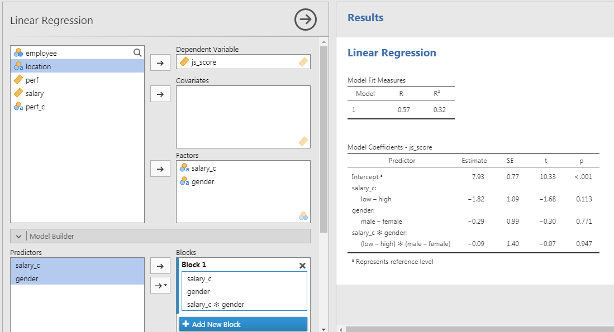
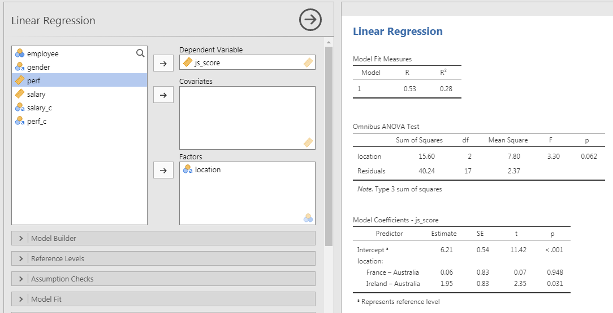
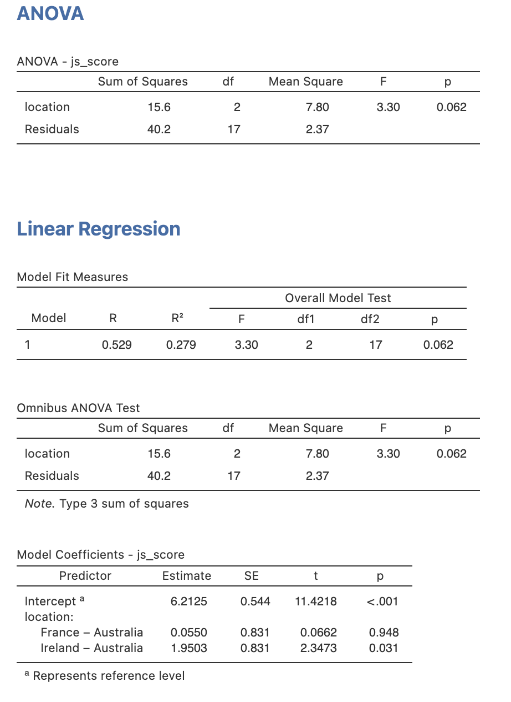

```{r setup, include = FALSE}
# libraries --------------------------------------------------------------------
library(anicon)
library(broom)
library(countdown)
library(DiagrammeR)
library(fontawesome)
library(ggrepel)
library(here)
library(kableExtra)
library(knitr)
library(papaja)
library(patchwork)
library(tidyverse)

# general options --------------------------------------------------------------
options(
  scipen = 999,
  htmltools.preserve.raw = FALSE
  )
set.seed(123)
# chunk options ----------------------------------------------------------------
opts_chunk$set(
  cache.extra = rand_seed, 
  message = FALSE, 
  warning = FALSE, 
  error = FALSE, 
  echo = FALSE,
  cache = FALSE,
  comment = "", 
  fig.align = "center", 
  fig.retina = 3
  )

# data -------------------------------------------------------------------------
organisation_beta <- read_csv(here("data/organisation_beta.csv"))

  # tibble::tibble(
  #   gender = sample(c("male", "female"), 20, replace = TRUE),
  #   location = sample(c("Ireland", "France", "Australia"), 20, replace = TRUE),
  #   perf = rnorm(20, mean = 4, sd = 2),
  #   salary = rnorm(20, mean = 30000, sd = 1000),
  #   js_score = -55 + 0.002 * salary + rnorm(20, mean = 2, sd = 1)
  # ) %>%
  # tibble::rownames_to_column("employee") %>%
  # dplyr::mutate(
  #   js_score = case_when(
  #     js_score > 10 ~ 10,
  #     js_score < 0 ~ 0,
  #     TRUE ~ js_score
  #   ),
  #   perf = case_when(
  #     perf > 10 ~ 10,
  #     perf < 0 ~ 0,
  #     TRUE ~ perf
  #   ),
  #   salary_c = case_when(
  #     salary >= mean(salary) ~ "high",
  #     salary < mean(salary) ~ "low"
  #   ),
  #   perf_c = case_when(
  #     perf >= mean(perf) + sd(perf) ~ "high",
  #     perf < mean(perf) + sd(perf) & perf >= mean(perf) - sd(perf) ~ "medium",
  #     perf < mean(perf) - sd(perf) ~ "low"
  #   ),
  # ) %>%
  # readr::write_csv(here::here("data/organisation_beta.csv"))

# analyses ---------------------------------------------------------------------
m_js_high <- mean(organisation_beta$js_score[organisation_beta$salary_c == "high"])
m_js_low <- mean(organisation_beta$js_score[organisation_beta$salary_c == "low"])
lm_1 <- lm(js_score ~ salary, data = organisation_beta) %>% apa_print
lm_2 <- lm(js_score ~ salary*perf, data = organisation_beta) %>% apa_print
lm_c <- lm(js_score ~ salary_c, data = organisation_beta) %>% apa_print
lm_c2 <- organisation_beta %>% 
  dplyr::mutate(salary_c = factor(salary_c, level = c("low", "high"))) %>% 
  lm(js_score ~ salary_c, data = .) %>% apa_print
lm_c3 <- lm(js_score ~ location, data = organisation_beta) %>% aov %>% apa_print

```

class: inverse, mline, center, middle

# Linear Regression for Hypothesis Testing with 1 or more Continuous Variables

---

# Applied Example

### Imagine the following case study...

> The CEO of the D&D company has problems with his employee well-being and wants to investigate the relationship between **Job Satisfaction (js_score)**, **salary** and **performance (perf)**.

--

### Therefore the CEO formulate 3 hypotheses:

- The $js\_score$ increases when employees' $salary$ increases
- The $js\_score$ increases when employees' $perf$ increases
- The effect of $salary$ on $js\_score$ is higher for high $perf$ than for low $perf$

--

### The corresponding model is:

$$js\_score = b_{0} + b_{1}\,salary + b_{2}\,perf + b_{3}\,salary*perf +  e$$

---

# Applied Example

### Variables
- Outcome = $js\_score$ (from 0 to 10)
- Predictor 1 = $salary$ (from 0 to Inf.)
- Predictor 2 = $perf$ (from 0 to 10)

### Hypotheses

- $H_{a_{1}}$: $js\_score$ increases when $salary$ increases (i.e., $b_1>0$) 
  - $H_{0_{1}}$: $js\_score$ stay the same when $salary$ increases (i.e., $b_1=0$)

- $H_{a_{2}}$: $js\_score$ increases when $perf$ increases (i.e., $b_2>0$) 
  - $H_{0_{2}}$: $js\_score$ stay the same when $perf$ increases (i.e., $b_2=0$)

- $H_{a_{3}}$: The effect of $salary$ on $js\_score$ increases when $perf$ increases (i.e., $b_3>0$) 
  - $H_{0_{3}}$: The effect of $salary$ on $js\_score$ is the same when $perf$ increases (i.e., $b_3=0$)
  
---

# Applied Example

### In JAMOVI

1. Open your file
2. Set variables as **continuous**
3. **Analyses** > **Regression** > **Linear Regression**
4. Set $js\_score$ as DV and $salary$ as well as $perf$ as Covariates
4. In the **Model Builder** option: 
  - Select both $salary$ and $perf$ to bring them in the covariates at once and to obtain a third term called $salary*perf$

```{r}
include_graphics("img/jamovi_lm_int.png")
```

---

# Communicate the Results

### Overall model:

> The prediction provided by the model with all predictors is significantly better than a model without predictors ( `r lm_2$full_result$modelfit$r2`).

### Salary Hypothesis:

> The effect of $salary$ on $js\_score$ is statistically significant, therefore $H_{0_{1}}$ can be rejected ( `r lm_2$full_result$salary`).

### Perf Hypothesis:

> The effect of $perf$ on $js\_score$ is not statistically significant, therefore $H_{0_{2}}$ can't be rejected ( `r lm_2$full_result$perf`).

### Interaction Hypothesis:

> The interaction effect is not statistically significant, therefore $H_{0_{3}}$ can't be rejected ( `r lm_2$full_result$salary_perf`).

---
class: title-slide, middle

## Exercise

Open the data `organisation_beta.csv` in JAMOVI and **reproduce the results obtained by testing**:

$$js\_score = b_{0} + b_{1}\,salary + b_{2}\,perf + b_{3}\,salary*perf + e$$

```{r}
countdown(minutes = 5, warn_when = 60)
```

---

class: inverse, mline, center, middle

# 1. Hypotheses with Categorical Predictors having 2 Categories

---

# Categorical Predictor with 2 Categories

Let's use an example with the `organisation_beta` dataset!

### Variable transformation

Instead of using $salary$ as a **continuous variable**, let's convert it as $salary\_c$ which is a **categorical variable**:
- Everything higher than or equal to salary average is labelled "**high**" salary
- Everything lower than salary average is labelled "**low**" salary

### Hypothesis

The $js\_score$ of employees having a **high** $salary\_c$ is different than the $js\_score$ of employees having a **low** $salary\_c$

### In mathematical terms

$$H_a: \mu(js\_score)_{high\,salary} \neq \mu(js\_score)_{low\,salary}$$
$$H_0: \mu(js\_score)_{high\,salary} = \mu(js\_score)_{low\,salary}$$

---

# Categorical Predictor with 2 Categories

An hypothesis of differences between two groups is easily tested with a **T-test** or with a **Linear Regression**:

- If $\mu_{1} \neq \mu_{2}$, the slope of the line between these averages is not null (i.e., $b_{1} \neq 0$)
- If $\mu_{1} = \mu_{2}$, the slope of the line between these averages is null (i.e., $b_{1} = 0$ )

**To test the influence of a categorical predictor** variable either nominal or ordinal **having two categories** (e.g., high vs. low, male vs. female, France vs. Ireland), it is possible to **test if**:

- The difference between $\mu_{1}$ and $\mu_{2}$ is significantly different than 0 (T-test) or 
- The $b$ associated to this predictor is significantly different than 0 (linear regression).

---

# The 3 Types of T-Tests

Different tests are:

1. **One Sample T-Test**: when the average of a full variable is compared to a specific value
2. **Independent Samples T-Test**: when the observations from the two groups compared are coming for different individuals
3. **Paired Samples T-Test**: when the observations from the two groups compared are coming for the same individuals (e.g., survey done every years on the exact same employees)

When group 1 and group 2 are not exactly the same, use **Independent Samples T-Test** 

Within each test, you have different options:

- "Tests": Student's, Welch's, or Mann-Whitney U
- "Hypothesis": $\mu_{1} \neq \mu_{2}$, $\mu_{1} > \mu_{2}$, $\mu_{1} < \mu_{2}$
- Missing Values
- Additional Statistics
- Assumption Checks

---

# T-Tests Options

#### 1. Tests

Student's expects group 1 and group 2 to have the same distribution while Welch's doesn't. Mann-Whitney reorder the Outcome variable in terms of ranking.

`r faa("arrow-circle-right", animate="horizontal", speed="slow", color="blue")` Use **Welch's** by default.

#### 2. Hypothesis

Hypotheses expecting a group being higher than another lead to more precise tests (i.e., non significant without specifying the direction). However, it usually give the same results.

`r faa("arrow-circle-right", animate="horizontal", speed="slow", color="blue")` Use $\mu_{1} \neq \mu_{2}$ by default.

#### 3. Missing Values

`r faa("arrow-circle-right", animate="horizontal", speed="slow", color="blue")` Use **Exclude cases analysis by analysis** as default.

---

# T-Tests Options

#### 4. Additional Statistics

Important information but not useful at a student level:
- **Mean difference** is the difference between $\mu_{1}$ and $\mu_{2}$
- **Effect size** is a standardized indicator of the difference between $\mu_{1}$ and $\mu_{2}$
- **Descriptives** is a short cut to calculate Mean and SD for each group
- **Descriptives plots** is a short cut to display Mean and SD on visualisations

#### 5. Assumption Checks

- **Homogeneity test** is not relevant if Welch's T-Test is used
- **Normality test** is important but not at a student level
- **Q-Q plot** is another Normality test, if the dots are more or less following the diagonal line, then it's fine

`r faa("exclamation-triangle", animate="flash", speed="slow", color="red")` **Q-Q plot** is NOT the representation of a linear regression. Linear Regression plots are obtained in **Exploration > Scatterplot**

---

# Comparing T-Test and Linear Regression

**Comparing the difference between two averages is the same as comparing the slope of the line crossing these two averages** therefore T-Tests and Linear Regression provide the same results

### Explanation

.pull-left[
- If two averages are **not equal**, then **the slope of the line crossing these two averages is not 0**
- If two averages are **equal**, then the **slope of the line crossing these two averages is 0**
]

.pull-right[
```{r fig.width=4, fig.height=4}
ggplot(organisation_beta, aes(x = salary_c, y = js_score)) + 
  geom_jitter(width = 0.1) +
  geom_segment(x = 1, xend = 2, y = m_js_high, yend = m_js_low, lwd = 2, color = "red") +
  geom_hline(yintercept = (m_js_high + m_js_low)/2, linetype = "dashed") +
  stat_summary(fun = mean, geom = "errorbar", aes(ymax = ..y.., ymin = ..y..), lwd = 2, color = "blue") +
  theme(
    legend.position = "none",
    text = element_text(size = 20)
    ) +
  labs(caption = "high coded 1 and low coded 2 (default)")
```
]

---

# Comparing T-Test and Linear Regression

```{r out.width='70%'}

```

.center[T-Test and Linear Regression provide the exact same results]

---

# Interaction with Categorical Variables

### Model Tested

$$js\_score = b_{0} + b_{1}\,salary\_c + b_{2}\,gender + b_{3}\,salary\_c*gender + e$$

Note: The test of the interaction effect corresponds to the test of a variable resulting from the multiplication between the codes of $salary\_c$ and the codes of $gender$.

### In JAMOVI

1. Open your file
2. Set variables according their type
3. **Analyses > Regression > Linear Regression**
4. Set $js\_score$ as DV and $salary\_c$ as well as $gender$ as Factors
4. In the **Model Builder** option: 
  - Select both $salary\_c$ and $gender$ to bring them in the Factors at once

---

# Interaction with Categorical Variables

```{r out.width='100%'}

```

---
class: title-slide, middle

## Live Demo

---
class: title-slide, middle

## Exercise

With the `organisation_beta.csv` data, test the following models and conclude on each effect:

Model 1: $js\_score = b_{0} + b_{1}\,perf + b_{2}\,gender + b_{3}\,perf*gender + e$

Model 2: $js\_score = b_{0} + b_{1}\,perf + b_{2}\,location + b_{3}\,perf*location+ e$

```{r}
countdown(minutes = 5, warn_when = 60)
```

---

class: inverse, mline, center, middle

# 2. Hypotheses with Categorical Predictor having 3+ Categories

---

# Categorical Predictor with 3+ Categories

### Problem with more than 2 groups

I would like to test the effect of the variable $location$ which has 3 categories: "Ireland", "France" and "Australia".

```{r}
include_graphics("img/jamovi_lm_main_c31.png")
```

In the Model Coefficient Table, to test the estimate of $location$, there is not 1 result for $location$ but 2!
- Comparison of "Australia" vs. "France"
- Comparison of "Australia" vs. "Ireland"

**Why multiple $p$-value are provided for the same predictor?**

---

# Coding Predictors with 3+ categories

### Variables
- Outcome = $js\_score$ (from 0 to 10)
- Predictor = $location$ (3 categories: *Australia*, *France* and *Ireland*)

.pull-left[
```{r}
df4 <- data.frame(
  employee = 1:8, 
  location = c("Ireland", "France", "Australia", "Australia", "Ireland", "France", "Australia", "Ireland"),
  js_score = c(8.9, 6.4, 7.1, 7.7, 9.6, 6.9, 5.9, 9.9)
) %>% 
  dplyr::mutate(location_c = case_when(
    location == "Australia" ~ 1,
    location == "France" ~ 2,
    location == "Ireland" ~ 3
  ))

kable(df4, format = "html") %>% 
  kable_styling(font_size = 14)
```
]

.pull-right[
```{r fig.height=5}
df4 %>% 
  ggplot(aes(x = factor(location, level = c("Australia", "France", "Ireland")), y = js_score)) +
  geom_point(color = "black", size = 5) +
  stat_summary(fun = "mean", colour = "blue", size = 6, geom = "point") +
  scale_x_discrete("location") +
  theme_bw() +
  theme(
    text = element_text(size = 20)
  )
```
]

---

# Coding Predictors with 3+ categories

$t$-test can only compare 2 categories. Because Linear Regression Models are (kind of) $t$-test, categories will be compared 2-by-2 with one category as the reference to compare all the others.

For example a linear regression of $location$ on $js\_score$ will display not one effect for the $location$ but the effect of the 2-by-2 comparison using a reference group by alphabetical order:

```{r results='asis'}
df4 %>% 
  lm(data = ., formula = js_score ~ location) %>% 
  tidy() %>% 
  mutate(p.value = format.pval(round(p.value, 3), eps = 0.001)) %>% 
  kable(digits = 2) %>%
  kable_styling(font_size = 16)
```

In our case the reference is the group "Australia" (first letter).

Here is our problem: **How to test the overall effect of a variable with 3 or more Categories?**

---

# ANOVA Test for Overall Effects

Beside Linear Regression and $t$-test, researchers are using ANOVA a lot. ANOVA, stands for Analysis of Variance and is also a sub category of Linear Regression Models.

ANOVA is used to calculate the overall effect of categorical variable having more that 2 categories as $t$-test cannot cope. In the case of testing 1 categorical variable, a "one-way" ANOVA is performed.

**How ANOVA is working?**

### In real words
- $H_a$: at least one group is different from the others
- $H_0$: all the groups are the same

### In mathematical terms
- $H_a$: it is **not true** that $\mu_{1} = \mu_{2} = \mu_{3}$
- $H_0$: it is **true** that $\mu_{1} = \mu_{2} = \mu_{3}$

---

# ANOVA Test for Overall Effects

In Jamovi, there are many ways to do an ANOVA.

From the ANOVA icon, you will find multiple types of ANOVAs:

- **One-Way ANOVA** for models with 1 categorical predictor having 3 or more categories
- **ANOVA** for models with more than 1 categorical predictor
- **Repeated Measure ANOVA** for models with categorical predictors made of the same individuals (e.g., surveys of the same employees at multiple times)
- **ANCOVA** for models with more than 1 categorical predictor and control variables
- **MANOVA** for models with more than 1 outcome variable (to avoid)

#### ANOVA analyses can also be done with Linear Regressions by selecting **Omnibus Test ANOVA test** in Model Coefficient Measure options

---

# ANOVA in our Example

An hypothesis for a categorical predictor with 3 or more categories predicts that **at least one group among the 3 groups will have an average significantly different than the other averages**.

### With $location$ the hypothesis is the following

> The $js\_score$ of employees working in at least one specific $location$ will be significantly different than the $js\_score$ of employees working in the other $location$.

### In mathematical terms

- $H_a$: it is **not** true that $\mu(js\_score)_{Ireland} = \mu(js\_score)_{France} = \mu(js\_score)_{Australia}$
- $H_0$: it is true that $\mu(js\_score)_{Ireland} = \mu(js\_score)_{France} = \mu(js\_score)_{Australia}$

This analysis is usually preformed using a one-way ANOVA but as ANOVA are special cases of the General Linear Model, let's keep this approach.

---

# ANOVA in our Example

```{r}
organisation_beta %>% 
  ggplot(aes(x = location, y =  js_score)) + 
  geom_jitter(width = 0.1) +
  geom_hline(yintercept = mean(organisation_beta$js_score), linetype = "dashed") +
  stat_summary(fun = mean, geom = "errorbar", aes(ymax = ..y.., ymin = ..y..), lwd = 2, color = "blue") +
  theme(
    legend.position = "none",
    text = element_text(size = 20)
  )
```

---

# ANOVA in our Example

### In JAMOVI

1. Open your file
2. Set variables according their type
3. Analyses > Regression > Linear Regression
4. Set $js\_score$ as DV and $location$ as Factors
5. In the **Model Coefficients** option: 
  - Select **Omnibus Test ANOVA test**

```{r out.width='60%'}

```

---

# Comparing ANOVA and Regression

```{r out.width='45%'}

```

.center[T-Test and Linear Regression provide the exact same results]

---
class: title-slide, middle

## Live Demo

---
class: title-slide, middle

## Exercise

Using the `organisation_beta.csv` dataset, test the following models and conclude on the hypothesis related to each estimate:

Model 1: $js\_score = b_{0} + b_{1}\,salary + b_{2}\,location + b_{3}\,perf + e$

Model 2: $$js\_score = b_{0} + b_{1}\,salary + b_{2}\,location + b_{3}\,perf + b_{4}\,salary*location +$$
$$b_{5}\,perf*location + b_{6}\,perf*salary + b_{7}\,salary*location*perf + e$$

```{r}
countdown(minutes = 5, warn_when = 60)
```

---
class: inverse, mline, left, middle


# Thanks for your attention and don't hesitate to ask if you have any question!

[`r fa(name = "twitter")` @damien_dupre](http://twitter.com/damien_dupre)  
[`r fa(name = "github")` @damien-dupre](http://github.com/damien-dupre)  
[`r fa(name = "link")` damien-datasci-blog.netlify.app](https://damien-datasci-blog.netlify.app)  
[`r fa(name = "paper-plane")` damien.dupre@dcu.ie](mailto:damien.dupre@dcu.ie)
