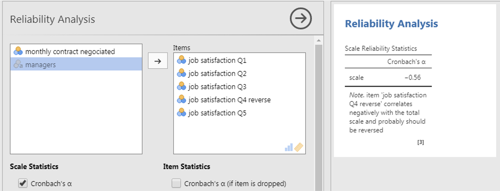
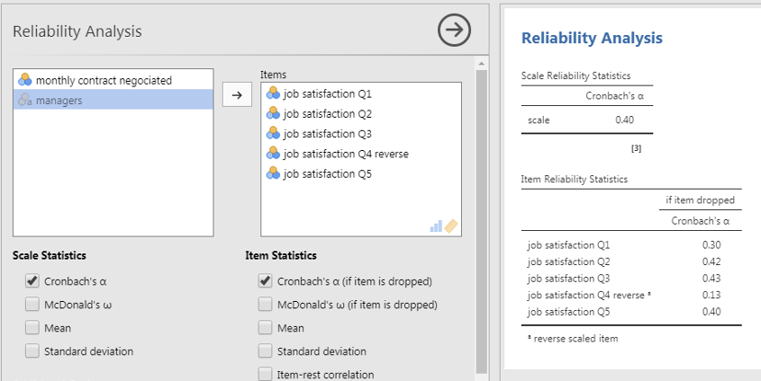
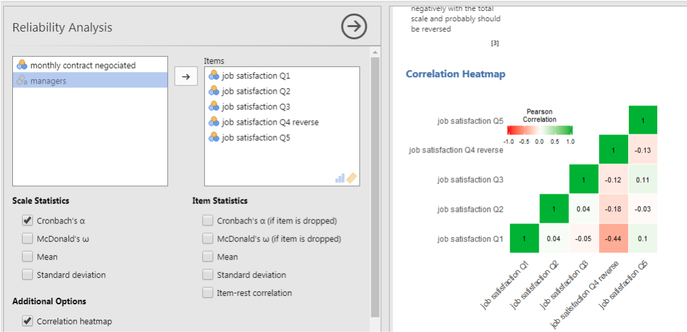
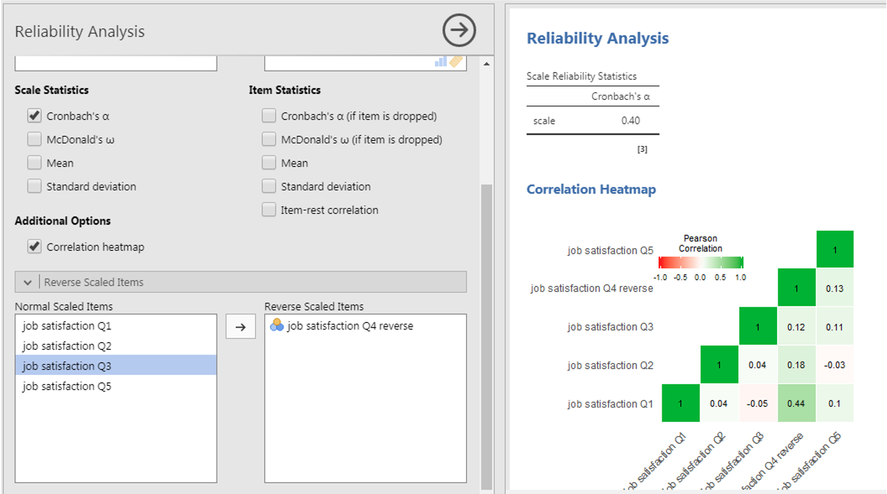
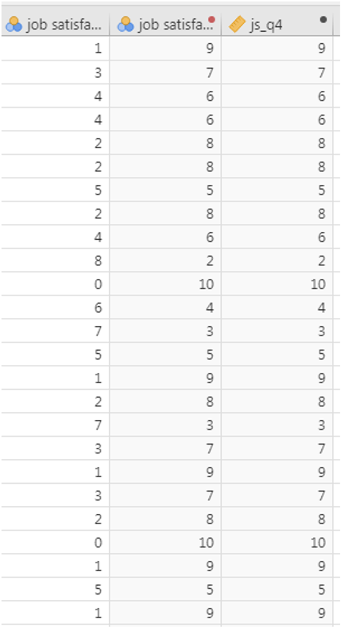
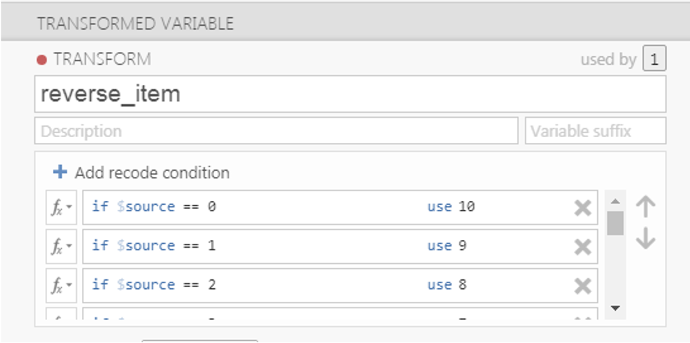
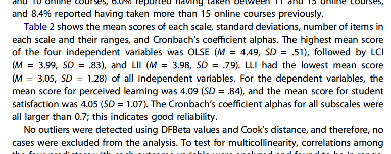

```{r setup, include = FALSE}
# libraries --------------------------------------------------------------------
library(anicon)
library(broom)
library(countdown)
library(DiagrammeR)
library(fontawesome)
library(ggrepel)
library(here)
library(kableExtra)
library(knitr)
library(papaja)
library(patchwork)
library(tidyverse)

# general options --------------------------------------------------------------
options(
  scipen = 999,
  htmltools.preserve.raw = FALSE
  )
set.seed(123)
# chunk options ----------------------------------------------------------------
opts_chunk$set(
  cache.extra = rand_seed, 
  message = FALSE, 
  warning = FALSE, 
  error = FALSE, 
  echo = FALSE,
  cache = FALSE,
  comment = "", 
  fig.align = "center", 
  fig.retina = 3
  )

# data -------------------------------------------------------------------------
organisation_beta <- read_csv(here("data/organisation_beta.csv"))
```

# Context

Remember our final aim, writing an academic research report/paper. The result section is actually not only made of the communication about Hypotheses Testing (Inferential Statistics) but also made of a preliminary section called **Descriptive Statistics**.

This section describes the variables used in your analyses:

- How were the variables created? Especially in case of Latent Variables
- What is their distribution? Using summary numbers and figures
- How are these variables behaving with each other? Using a correlation matrix

```{r out.width='30%'}
include_graphics("https://memegenerator.net/img/instances/42703430/i-want-you-to-calculate-descriptive-statistics.jpg")
```

---
class: inverse, mline, center, middle

# 1. Latent Variables and Reliability Analysis

---

# Latent Variable

In order to measure the theoretical constructs/concepts of your model, you will have to select the best measurement scale made of multiple items.

Reliability assessment is performed every time a scale is used (Cronbach's alpha)

Cronbach's alpha indicates the overall correlation between items

Cronbach's alpha ranges from -1 to 1:

- If its value is higher than 0.7, then the scale is reliable to measure the latent variable 
- If its value is lower than 0.7, then proceed with caution or remove/modify the scale to obtain a value higher than 0.7

---

# Cronbach's alpha in JAMOVI

In the Analysis Tab:
1. Click Factor icon
2. Select Reliability Analysis

```{r out.width='100%'}

```

In our example, alpha = -0.56: This is not enough and something is wrong
---

# Cronbach's alpha in JAMOVI - Solution 1

Have a look at the Cronbach's alpha if item is dropped

```{r out.width='100%'}

```

---

# Cronbach's alpha in JAMOVI - Solution 2

Have a look at the correlation heatmap
- If one item is negatively correlated with the others (values < 0 and red colour), this item is reversed and has to be recoded
- Add the negatively correlated item to “Reverse Scaled Item" to observe the effect of changes

```{r out.width='80%'}

```

---

# Cronbach's alpha in JAMOVI - Solution 2

Have a look at the correlation heatmap
- If one item is negatively correlated with the others (values < 0 and red colour), this item is reversed and has to be recoded
- Add the negatively correlated item to “Reverse Scaled Item" to observe the effect of changes

```{r out.width='80%'}

```

---

# Manually Recode Variable

.pull-left[
Some scales include negative formulation of some items to check that participants are reading the questions.

For example in a Job Satisfaction scale:
- It. 1: I love my job
- It. 2: I like going to work everyday
- It. 3: I hate what I'm doing at work

If I answer high to the 2 first items, my answer to the 3rd item should be low.

The values of an item from 0 to 10 has to be reversed:
- 0 becomes 10
- 1 becomes 9
- ...
- 10 becomes 0
]

.pull-right[
```{r out.width='80%'}

```
]

---

# Manually Recode Variable

In Jamovi:
- Data > Transform: edit

```{r out.width='80%'}

```

---

# Manually Recode Variable

In Jamovi:
- Data > Compute Variable
```
= (max scale + min scale) - variable
```

```{r out.width='80%'}
include_graphics("img/cronbach_8.png")
```

---

# Compute Latent Variable Score

When Cronbach's alpha is satisfying enough, then calculate the latent variable score by averaging the items kept and reversed (don't include original items if they have been reversed)

```{r out.width='50%'}
include_graphics("https://www.memecreator.org/static/images/memes/3335270.jpg")
```

---
class: title-slide, middle

## Live Demo

---

class: inverse, mline, center, middle

# 2. Describing the Distribution of Variables

---

# Describing the Distribution of Variables

In an Academic Research Paper, once the latent variables are calculated, basic statistical summaries are calculated and presented in a text:

```{r out.width='100%'}

```

---

# Summary Tables in Jamovi

```{r out.width='100%'}
include_graphics("img/jamovi_descr_table.png")
```

---

# Summary Figures in Jamovi

```{r out.width='100%'}
include_graphics("img/jamovi_descr_figure_1.png")
```

---

# Summary Figures in Jamovi

```{r out.width='100%'}
include_graphics("img/jamovi_descr_figure_2.png")
```

---
class: title-slide, middle

## Live Demo

---

class: inverse, mline, center, middle

# 3. Describing the Relationship Between Predictor

---

# Correlation Matrix with Predictors

```{r out.width='100%'}
include_graphics("img/jamovi_correlation_matrix.png")
```

---

# $p$-hacking in Correlation Matrices

The use of correlation tables is widespread in the literature, and they are a great tool for descriptive analysis but **do not test your hypotheses with correlation matrices**. A good practice is to remove all $p$-values or $p$-stars from them.

$p$-values should only be produced to test an hypothesis that has been already formulated, any other is use is called $p$**-hacking**.

```{r out.width='40%'}
include_graphics("https://media.makeameme.org/created/what-is-something-5ea39c449c.jpg")
```

---
class: title-slide, middle

## Live Demo

---
class: title-slide, middle

## Exercise: Descriptive Statistics

Use the data file "manager_satisfaction_performance.csv" in Jamovi to:
- Evaluate the reliability of the 3 scales
- Calculate the score for each scale
- Produce descriptive tables and figures from the latent variables according to the gender variable 
- Produce the correlation matrix of the Predictors Monthly-contract-negotiated, Stress and Turnover Intentions

```{r}
countdown(minutes = 15, warn_when = 60)
```

---
class: inverse, mline, left, middle


# Thanks for your attention and don't hesitate to ask if you have any question!

[`r fa(name = "twitter")` @damien_dupre](http://twitter.com/damien_dupre)  
[`r fa(name = "github")` @damien-dupre](http://github.com/damien-dupre)  
[`r fa(name = "link")` damien-datasci-blog.netlify.app](https://damien-datasci-blog.netlify.app)  
[`r fa(name = "paper-plane")` damien.dupre@dcu.ie](mailto:damien.dupre@dcu.ie)