```{r setup, include = FALSE}
# general options --------------------------------------------------------------
options(
  scipen = 999,
  htmltools.preserve.raw = FALSE,
  knitr.kable.NA = " - "
  )
set.seed(42)
# chunk options ----------------------------------------------------------------
knitr::opts_chunk$set(
  cache.extra = knitr::rand_seed, 
  message = FALSE, 
  warning = FALSE, 
  error = FALSE, 
  echo = FALSE,
  cache = FALSE,
  comment = "", 
  fig.align = "center", 
  fig.retina = 3
  )
# libraries --------------------------------------------------------------------
library(tidyverse)
library(knitr)
library(kableExtra)
library(nomnoml)
library(countdown)
```

# Previously ...

After having:

#### 1. Downloaded your Data

#### 2. Cleaned your Data

#### 3. Transformed your Data

It is time to look at your Data!

Data visualisations are important:
- For the Data Analyst/Scientist to understand what is going on with your data (e.g. errors, unexpected data, outline data analyses to perform)
- For the reader to access the message and to be convinced of the arguments

**Always look at your data before doing any analyses and do convincing visualisations!**

---

# Visualisation Requirement

**Variables have different types:**
- **Categorical**: If the variable's possibilities are words or sentences (character string)
  - if the possibilities cannot be ordered: Categorical Nominal (*e.g.*, gender)
  - if the possibilities can be ordered: Categorical Ordinal (*e.g.*, opinion scales)
- **Continuous**: If the variable's possibilities are numbers
  - if it starts from 0: Continuous Ratio (*e.g.*, age)
  - if it it goes below 0: Continuous Interval (*e.g.*, temperature) 

Variables can be converted to either Categorical and Continuous but it is always better to keep them in their correct scale.
> Example, Likert item (Opinion question from disagree to agree) are Categorical Ordinal but are analysed as Continuous.

.pull-left[
Remember these 3 icons: 
- Ruler
- Histogram
- Venn Diagram
]
.pull-right[
```{r out.width='40%'}
include_graphics("img/jamovi_icons.png")
```
]

---
class: title-slide, middle

## Exercise (5 min)

---

# Guess Variable Type - Exercise (1)

```{r}
  tribble(
    ~`Variable Name`, ~`Variable Range`, ~`Variable Type`,
    "Gender", "Male/Female/Other", NA,
    "Country", "Ireland/France/USA", NA,
    "Age", "0 to Inf", NA, 
    "Age", "0-19, 20-29, 30-39, 40-49", NA, 
    "Price", "0 to Inf", NA, 
    "Temperature", "-Inf to Inf", NA, 
    "IQ", "Low/Mid/High", NA, 
    "Results", "0 to 100", NA, 
    "Results", "Fail/Pass/2:1/First", NA
  ) %>% 
  kable() %>%
  column_spec(1, width = "10em") %>%
  column_spec(2, width = "20em") %>%
  column_spec(3, width = "20em")
```

```{r echo = FALSE}
countdown(minutes = 3)
```

---

# Guess Variable Type - Solution (1)

```{r}
  tribble(
    ~`Variable Name`, ~`Variable Range`, ~`Variable Type`,
    "Gender", "Male/Female/Other", "Categorical Nominal",
    "Country", "Ireland/France/USA", "Categorical Nominal",
    "Age", "0 to Inf", "Continuous", 
    "Age", "0-19, 20-29, 30-39, 40-49", "Categorical Ordinal", 
    "Price", "0 to Inf", "Continuous", 
    "Temperature", "-Inf to Inf", "Continuous", 
    "IQ", "Low/Mid/High", "Categorical Ordinal", 
    "Results", "0 to 100", "Continuous", 
    "Results", "Fail/Pass/2:1/First","Categorical Ordinal"
  ) %>% 
  kable() %>%
  column_spec(1, width = "10em") %>%
  column_spec(2, width = "20em") %>%
  column_spec(3, width = "20em")
```

---

# Guess Variable Type - Exercise (2)

```{r out.width='100%'}
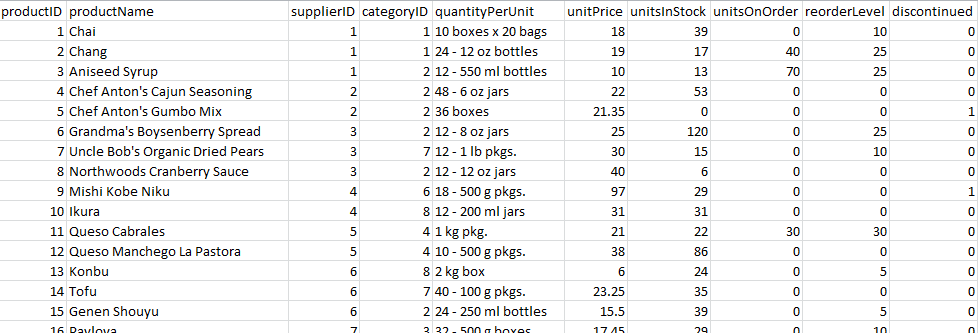
```

```{r}
  tribble(
     ~`Variable Name`, ~`Variable Type`,
        "productName",               NA,
         "supplierID",               NA,
         "categoryID",               NA,
    "quantityPerUnit",               NA,
          "unitPrice",               NA,
       "unitsInStock",               NA
  ) %>% 
  kable() %>%
  kable_styling(font_size = 14) %>%
  column_spec(1, width = "10em") %>%
  column_spec(2, width = "20em")
```

```{r echo = FALSE}
countdown(minutes = 2)
```

---

# Guess Variable Type - Solution (2)

```{r out.width='100%'}

```

```{r}
  tribble(
     ~`Variable Name`,      ~`Variable Type`,
        "productName", "Categorical Nominal",
         "supplierID", "Categorical Nominal",
         "categoryID", "Categorical Nominal",
    "quantityPerUnit", "Categorical Nominal",
          "unitPrice",          "Continuous",
       "unitsInStock",          "Continuous"
  ) %>% 
  kable() %>%
  kable_styling(font_size = 14) %>%
  column_spec(1, width = "10em") %>%
  column_spec(2, width = "20em")
```

---

class: inverse, mline, center, middle

# 1. The Key Figures

---

# Why Using Figures

1. When creating a report (academic or industrial), always TELL A STORY

2. The figure is here to support your story and to make it more convincing

**Warning:** Be careful, figures can lie or be misleading, use with ethics and professionalism

```{r out.width='60%'}
include_graphics("https://i0.wp.com/flowingdata.com/wp-content/uploads/2017/09/Fancy-dataviz-vs-best-chart-for-the-data.png")
```
.center.tiny[Source: www.flowingdata.com [`r emo::ji("link")`](https://i0.wp.com/flowingdata.com/wp-content/uploads/2017/09/Fancy-dataviz-vs-best-chart-for-the-data.png)]

---

# Master the Key Figures

```{r out.width='100%'}
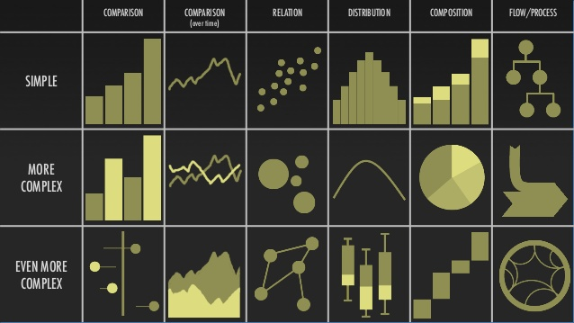
```

---

# Master the Key Figures

Keep your figures:
.pull-left[
#### 1. Clear

Complex figures should be cristal clear, use design features (colours, sizes, ...) to make them clear

#### 2. Self-Explanatory

Always use a caption, a legend and well defined axes
]
.pull-right[
```{r out.width='100%'}
include_graphics("https://venngage-wordpress.s3.amazonaws.com/uploads/2020/06/image17.png")
```
.center.tiny[Source: www.venngage.com [`r emo::ji("link")`](https://venngage-wordpress.s3.amazonaws.com/uploads/2020/06/image17.png)]
]

---

# Master the Key Figures

The main interest of Figure is their ability to ... aggregate data to meaningful information

This **aggregation**, is done with basic statistical calculations:

.pull-left[
```{r}
  tribble(
    ~`Student Number`, ~Group, ~Mark,
    "S1", "A", "60",
    "S2", "B", "70",
    "S3", "A", "60",
    "S4", "B", "55",
    "S5", "A", "65",
    "S6", "B", "65",
    "S7", "A", "65"
  ) %>% 
  kable()
```
]
.pull-right[
- Count
  - Group A = 4 students
  - Group B = 3 students
- Proportion
  - Group A = 57% (4/7)
  - Group B = 43% (3/7)
- Density
  - 0 to 50 = 0%, 55 = 14%, 60 = 29%,
  - 65 = 43%, 70 = 14%, 75 to 100 = 0%
- Median/Quartiles
  - Q1 = 60, Med = 65, Q3 = 65
- Mean/Standard Deviation
  - Mean = 62.8, SD = 4.9
]

---

# Zoom on Median/Quartiles

```{r out.width='50%'}
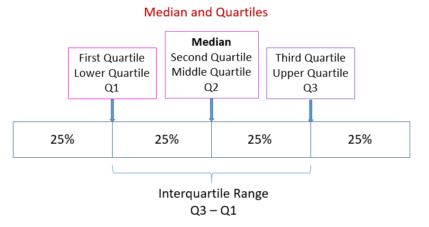
```

---

# Zoom on Median/Quartiles

```{r out.width='50%'}
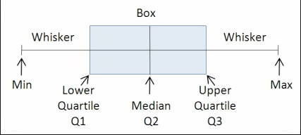
```

```{r out.width='50%'}
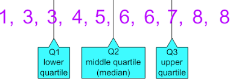
```

---

# Zoom on Mean/SD

- Mean or Average is the Sum of all the data divided by their Number

- Standard Deviation is [the square root of] the average distance to the mean

```{r out.width='70%'}
include_graphics("https://s4be.cochrane.org/app/uploads/2018/09/Image-1-Standard-deviation-Standard-error-.jpg")
```

---

# Zoom on Correlation

Line between 2 Continuous Variables is a Regression Line
Corresponds to the best fit:
$$Y = b0 + b1 . X + e$$

.pull-left[
```{r out.width='100%'}
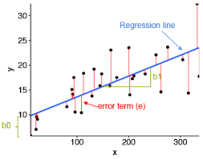
```
]
.pull-right[
Meaning of each symbol:
- $b0$ is **the intercept** (value of Y when X is 0)
- $b1$ is **the slope** of the line which corresponds to the **correlation coefficient between X and Y**
- $e$ is **the error** (distance between the points and the line also called residual)
]

---

# Zoom on Correlation

Correlation is obtained by drawing the best line between the points and by calculating the slope of this line

Correlation is a value from -1 to +1 which indicate the strength and direction of a relationship:

- Close to +1 is Strong Positive relationship
- Close to -1 is Strong Negative relationship
- Close to 0 is No relationship

Examples:

```{r out.width='70%'}
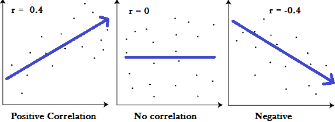
```

---

# Master the Key Figures

```{nomnoml, fig.width=12, fig.height=6}
#stroke: black
#direction: right
#align: center
#fill: orange
[Variable(s) to analyse]->[Categorical]
[Variable(s) to analyse]->[Continuous]
[Variable(s) to analyse]->[Categorical & Categorical;Categorical & Continuous]
[Variable(s) to analyse]->[Continuous & Continuous]

[Categorical]->[COMPOSITION]
[Continuous]->[DISTRIBUTION]
[Categorical & Categorical;Categorical & Continuous]->[COMPARISON]
[Continuous & Continuous]->[RELATIONSHIP]
```

---

class: inverse, mline, center, middle

# 1.1. COMPOSITION Type Figures

---

# COMPOSITION Type Figures

- Count of different categories 

.pull-left[
```{r out.width='40%'}
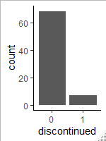
```
]
.pull-right[
```{r out.width='68%'}
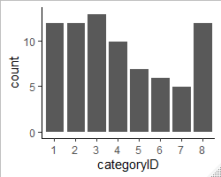
```
]

- Proportion of different categories 

.pull-left[
```{r out.width='100%'}
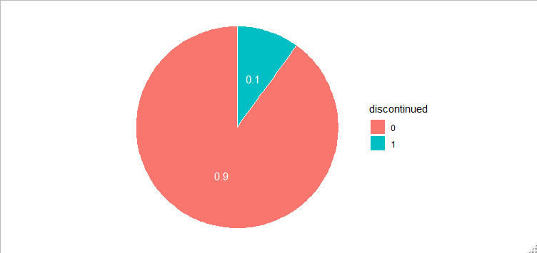
```
]
.pull-right[
```{r out.width='68%'}
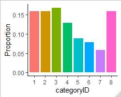
```
]

---

# When to Use a Pie Chart?

Use pie charts when the variable has only to categories:

```{r out.width='50%'}
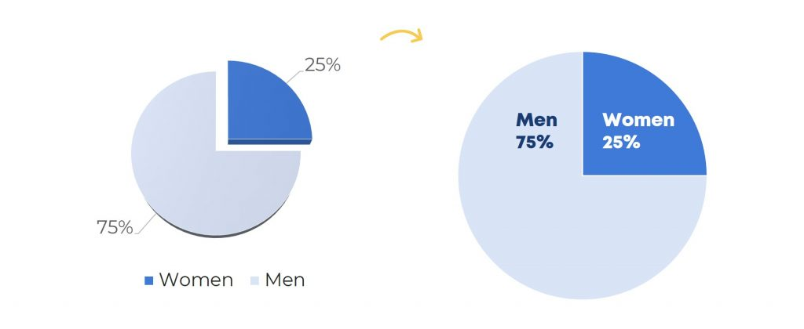
```

If your variable has more than 2 categories then use bar chart:

```{r out.width='50%'}
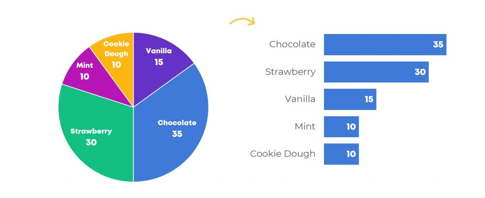
```

See: https://depictdatastudio.com/when-pie-charts-are-okay-seriously-guidelines-for-using-pie-and-donut-charts/

---

class: inverse, mline, center, middle

# 1.2. DISTRIBUTION Type Figures

---

# DISTRIBUTION Type Figures

##.center[Histogram - Density - BoxPlot - Dynamite]

```{r out.width='25%', fig.align='default'}
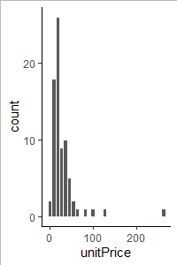
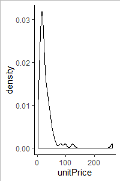
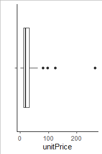
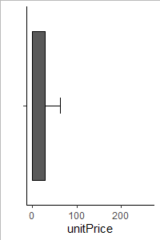
```

---

class: inverse, mline, center, middle

# 1.3. COMPARISION Type Figures

---

# COMPARISION - Categorical/Categorical

Count of different values 
.center[
```{r out.width='40%', fig.align='default'}
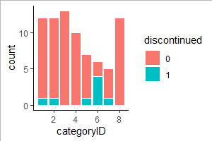
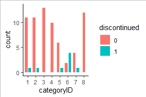
```
]

Proportion of different values  

```{r out.width='50%'}
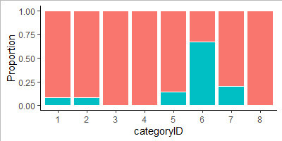
```

---

# COMPARISION - Categorical/Continuous

Count of different values according Categories

```{r out.width='50%', fig.align='default'}
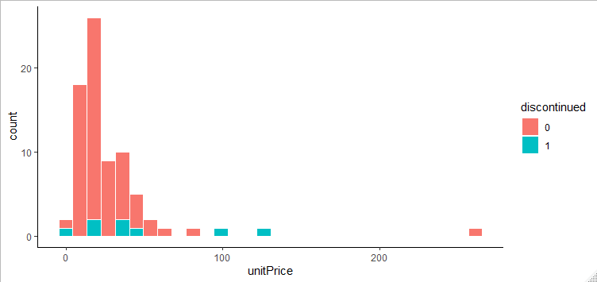
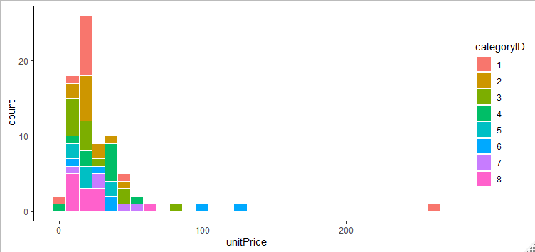
```

```{r out.width='50%', fig.align='default'}
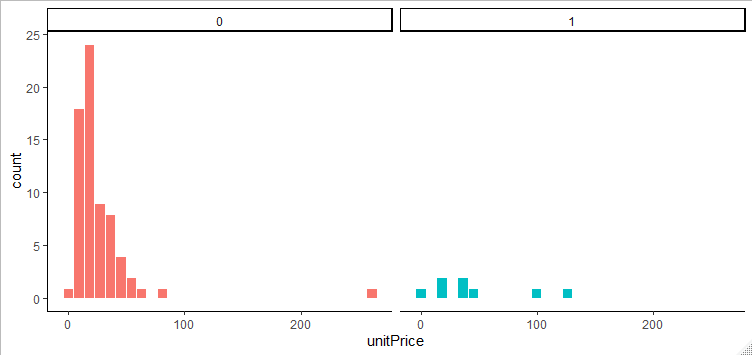
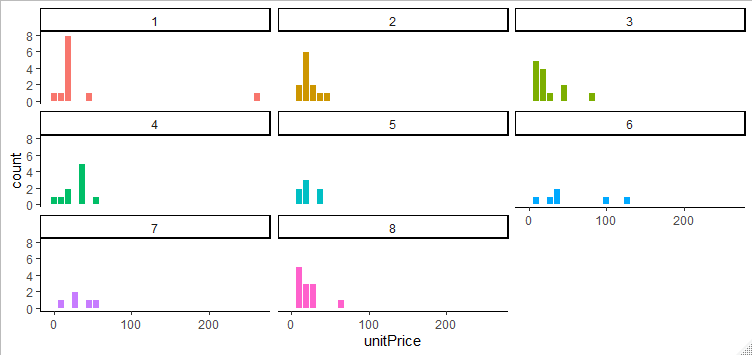
```

---

# COMPARISION - Categorical/Continuous

Density of different values according Categories

```{r out.width='50%', fig.align='default'}
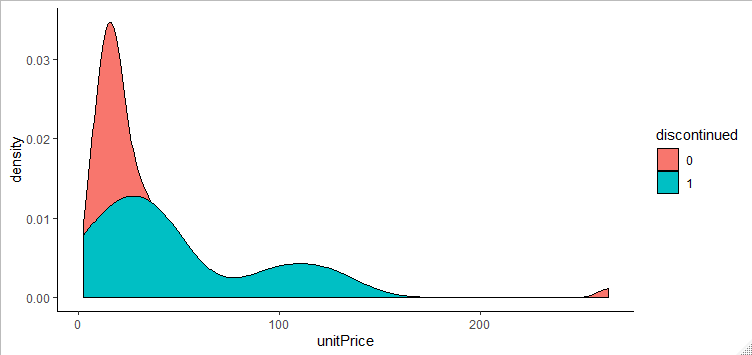
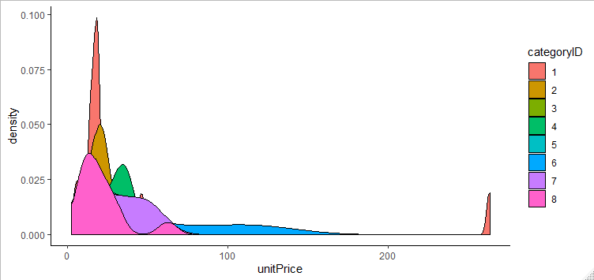
```

```{r out.width='50%', fig.align='default'}
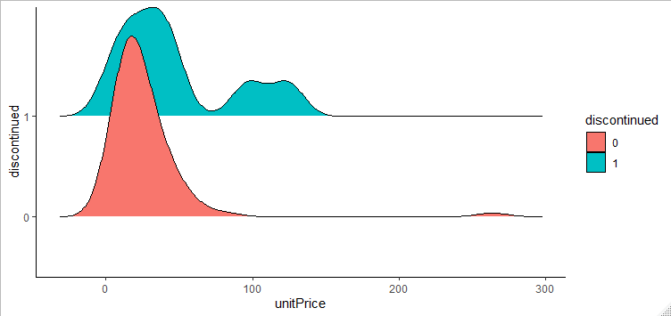
include_graphics("img/media_lecture_3/image29.png")
```

---

# COMPARISION - Categorical/Continuous

Median/Quartiles according Categories

```{r out.width='50%', fig.align='default'}
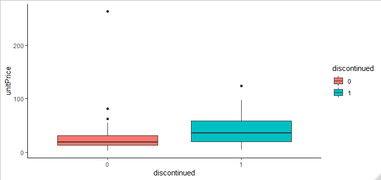
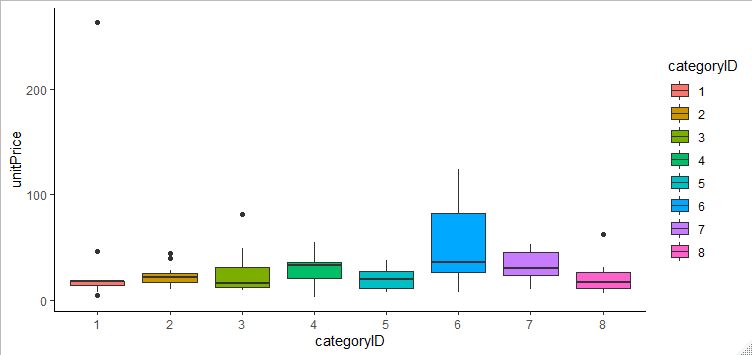
```

```{r out.width='50%', fig.align='default'}
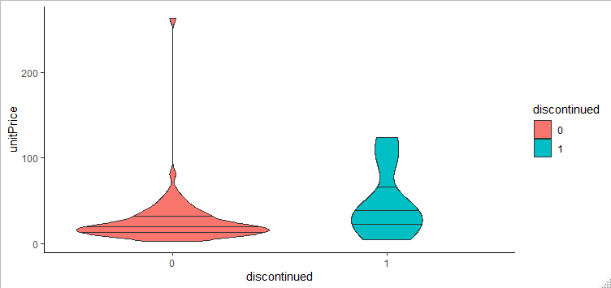
include_graphics("img/media_lecture_3/image34.png")
```

---

# COMPARISION - Categorical/Continuous

Mean/Standard Deviation according Categories

```{r out.width='50%'}
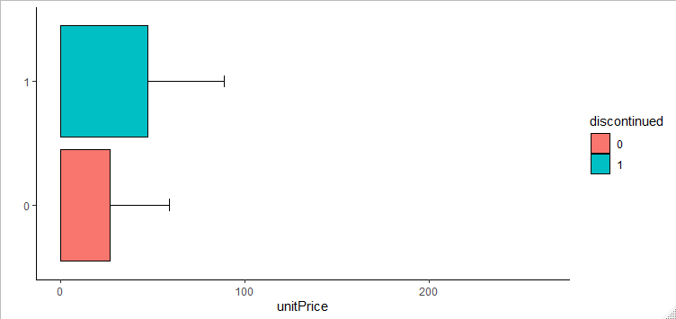
```

```{r out.width='50%', fig.align='default'}
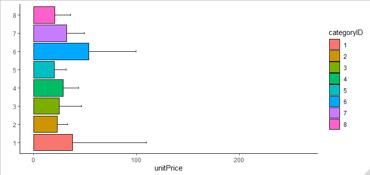
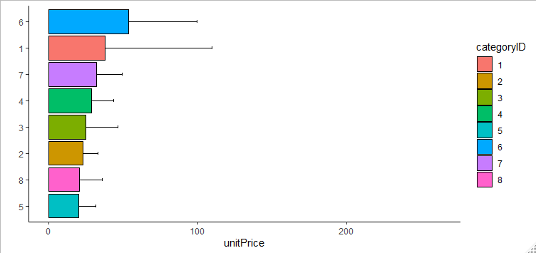
```

---

class: inverse, mline, center, middle

# 1.4. RELATIONSHIP Type Figures

---

# RELATIONSHIP - Continuous/Continuous

```{r out.width='50%', fig.align='default'}
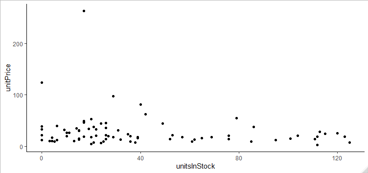
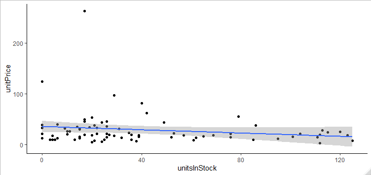
```

Continuous X Continuous X Categorical

```{r out.width='50%', fig.align='default'}
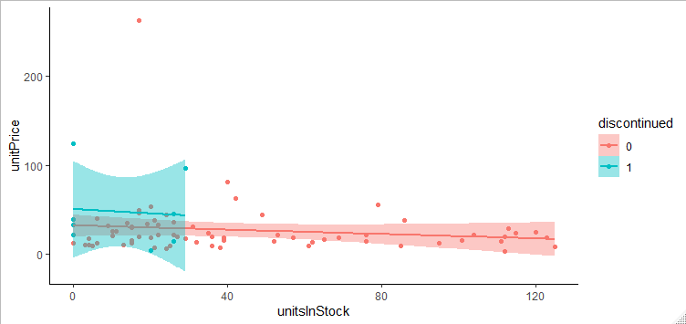
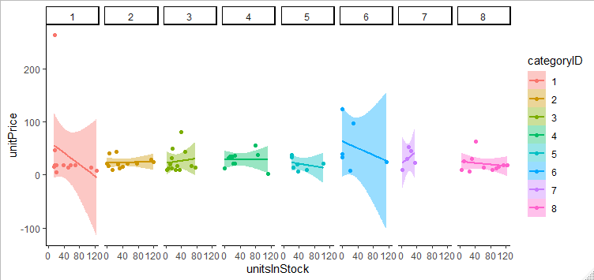
```

---

class: inverse, mline, center, middle

# 2. Customise your Figures

---

# Master the Key Figures

```{r out.width='70%'}
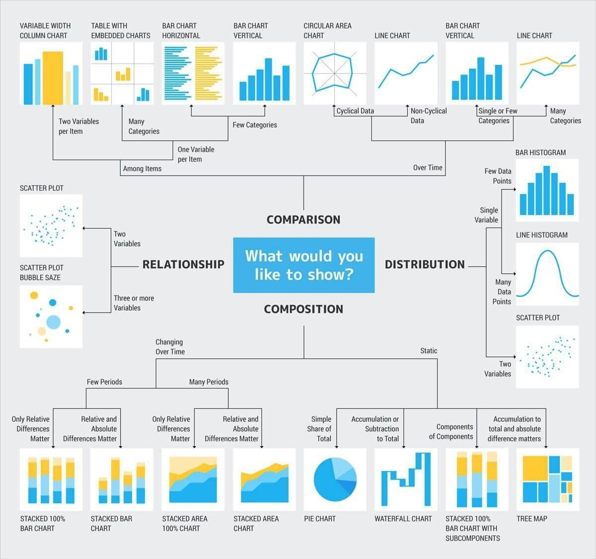
```

---

# Customise Figures

.pull-left[
- Colours
- Size dots
- Shapes
- Position (*i.e.* stack or dodge)
- Orientation (vertical or horizontal)
- Text content and font
- Figure legend
]

.pull-right[
```{r out.width='100%'}
include_graphics("img/media_lecture_3/image45.png")
```
]

---

# Use Figures

Use Figures only if they ...
- Are self-explanatory
- Help to understand your message (a figure is not a message)

--

Don’t duplicate the information
- Always give the information in the main text of your report but
- Don’t show a table and a figure with the same information

--

To tell a story!
- Set of observations, facts, or events, true or invented, that are presented in a specific order such that they create an emotional reaction in the audience
- Even if you think data are boring, make them interesting for your audience

---
class: title-slide, middle

## Exercise (10 min)

---

# What’s Wrong Here?

```{r out.width='100%'}
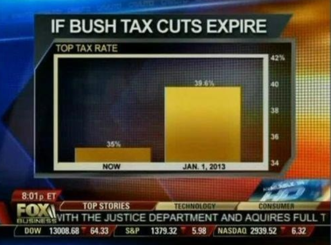
```

---

# What’s Wrong Here?

```{r out.width='100%'}
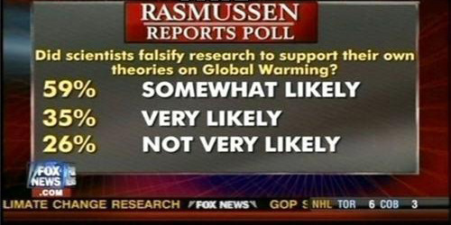
```

---

# What’s Wrong Here?

```{r out.width='100%'}
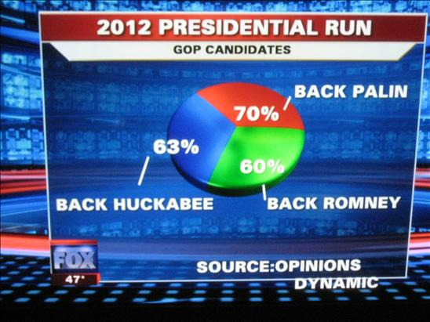
```

---

# What’s Wrong Here?

```{r out.width='100%'}
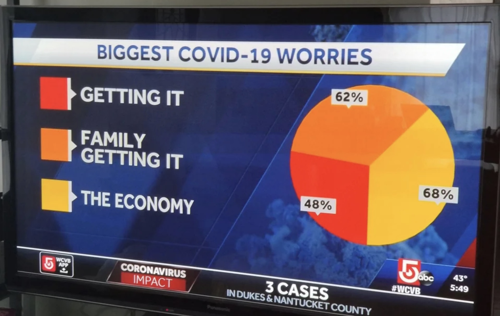
```

---

# What’s Wrong Here?

```{r out.width='100%'}
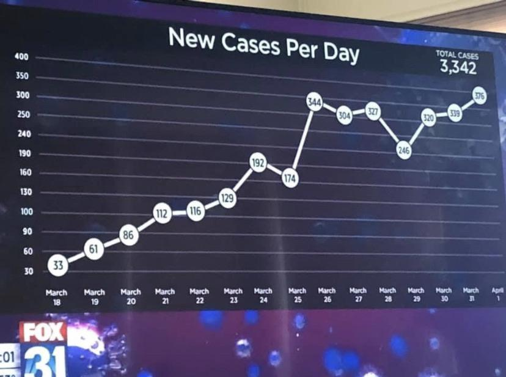
```

---

# What’s Wrong Here?

```{r out.width='70%'}
include_graphics("img/media_lecture_3/image51.png")
```

---

# What’s Wrong Here?

```{r out.width='100%'}
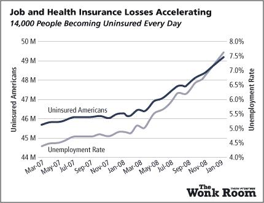
```

---

# What’s Wrong Here?

```{r out.width='100%'}
include_graphics("img/media_lecture_3/image53.jpeg")
```

---

# What’s Wrong Here?

```{r out.width='80%'}

```

---

# Land don't Vote, People do

```{r out.width='100%'}
include_graphics("img/media_lecture_3/image55.gif")
```

---

# A Must Read

> “Mistakes, we’ve drawn a few. Learning from our errors in data visualisation” by The Economist

https://medium.economist.com/mistakes-weve-drawn-a-few-8cdd8a42d368

Example:

```{r out.width='100%'}
include_graphics("https://miro.medium.com/max/2560/1*9QE_yL3boSLqopJkSBfL5A.png")
```

---

class: inverse, mline, center, middle

# 3. Fundamentals of Data Visualization

---

# The Book

.pull-left[
**Fundamentals of Data Visualization** 
by Claus O. Wilke

Free online at https://clauswilke.com/dataviz/

Provides basic principles for data visualisation
]

.pull-right[
```{r out.width='100%'}
include_graphics("img/media_lecture_3/image56.png")
```
]

---

# Principle 1: Axes

### .center[Don’t cheat with axes, include 0 when 0 is meaningful]

.center[
```{r out.width='45%', fig.align='default'}
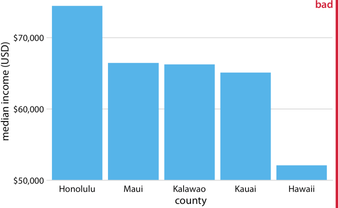
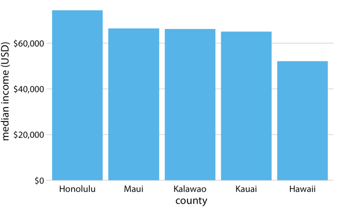
```

```{r out.width='45%', fig.align='default'}
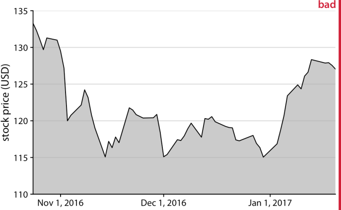
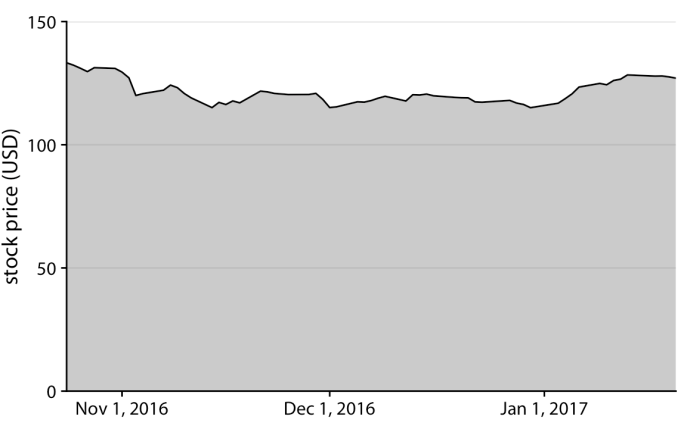
```
]

---

# Principle 1: Axes

### .center[Don’t cheat with axes, include 0 when 0 is meaningful]

.center[
```{r out.width='50%', fig.align='default'}
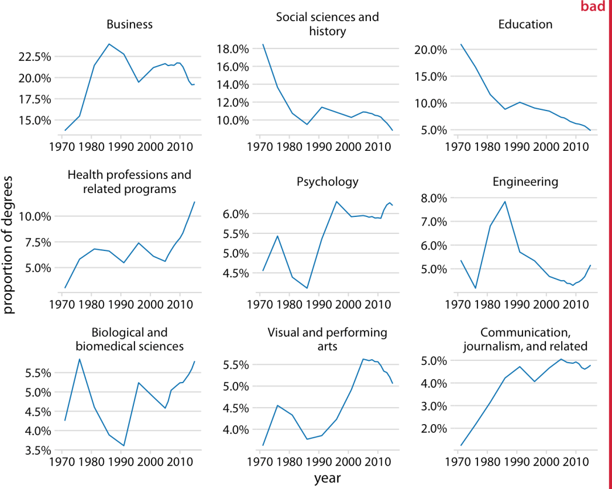
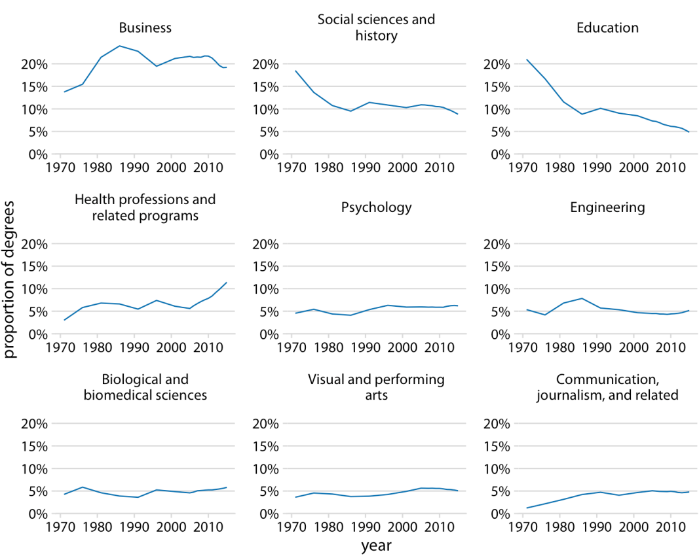
```
]

---

# Principle 2: Make it Easy

### .center[Make your figure easy to read and to understand]

.center[
```{r out.width='50%', fig.align='default'}


```
]

---

# Principle 3: Be Fancy

### .center[Be fancy, use extract features if it helps, such as transparency and jitter]

.center[
```{r out.width='50%', fig.align='default'}


```
]

---

# Principle 3: Be Fancy

### .center[Be fancy, use extract features if it helps, such as transparency and jitter]

.center[
```{r out.width='50%', fig.align='default'}


```
]

---

# Principle 4: Colours

### .center[Use colours but not too many and be careful to vision disabilities]

.pull-left[
```{r out.width='100%'}
include_graphics("img/media_lecture_3/image69.png")
```
]
.pull-right[
```{r out.width='100%'}

```
]

---

# Principle 4: Colours

### .center[Keep the same colours for the same variables]

.center[
```{r out.width='50%', fig.align='default'}

include_graphics("img/media_lecture_3/image72.png")
```
]

---

# Principle 5: Details

### .center[Every details count and lazy work is easily spotted]

.center[
```{r out.width='50%', fig.align='default'}


```
]

---

# Principle 5: Details

### .center[Be precise and use captions, axes, and titles to do it]

```{r out.width='70%'}

```

---
class: inverse, mline, center, middle

# 4. Visualise with MS EXCEL

---

# COMPOSITION Type Figures

Pie chart for Categorical variable

```{r out.width='100%'}

```

---

# COMPOSITION Type Figures

Bar chart for Categorical variable

```{r out.width='100%'}

```

---

# DISTRIBUTION Type Figures

Histogram for Continuous variable

```{r out.width='100%'}

```

---

# DISTRIBUTION Type Figures

Density plot for Continuous variable

```{r out.width='100%'}

```

---

# DISTRIBUTION Type Figures

Box plot for Continuous variable

```{r out.width='100%'}

```

---

# DISTRIBUTION Type Figures

Dynamite plot for Continuous variable

```{r out.width='100%'}

```

---

# COMPARISION Type Figures

Multiple histograms?

```{r out.width='100%'}

```

---

# COMPARISION Type Figures

Multiple box plot?

```{r out.width='100%'}

```

---

# COMPARISION Type Figures

Multiple dynamite plot?

```{r out.width='100%'}

```

---

# RELATIONSHIP Type Figures

Linear regression?

```{r out.width='100%'}

```

---

# Visualisation with MS EXCEL

As a spreadsheet software, MS EXCEL is ok for data cleaning and data transformation.

However, avoid using MS EXCEL for data visualisation, prefer either TABLEAU or JAMOVI

If you use MS EXCEL, make sure that no one is able to identify that you have done it with MS EXCEL by to customising your figures with:
- Text font
- Colours
- Background
- ...

Avoid your figures looking like that!

```{r out.width='70%'}
include_graphics("https://i2.wp.com/www.real-statistics.com/wp-content/uploads/2012/11/bar-chart.png")
```
.center.tiny[Source: www.real-statistics.com [`r emo::ji("link")`](https://i2.wp.com/www.real-statistics.com/wp-content/uploads/2012/11/bar-chart.png)]

---

# Visualisation Dashboards

Since 10 years, dashboards have became more and more popular in organisation:
- Display multiple information at once
- GUI base/easy to use
- Auto update when connected to a server
- Fancy visualisation design/interactive

Two major contenders: Tableau vs. PowerBI

```{r}
data.frame(
  Tableau = c(
    "Tableau can handle a huge volume of data with better performance.",
    "Tableau is a little difficult.",
    "Embedding report is a real-time challenge in Tableau"
  ),
  PowerBI = c(
    "PowerBI can handle a limited volume of data.",
    "PowerBI Interface is very easy to learn.",
    "Embedding report is easy with PowerBI.")
     ) %>% 
  kable() %>%
  column_spec(1, width = "20em") %>%
  column_spec(2, width = "20em")
```
.center.tiny[Source: www.guru99.com [`r emo::ji("link")`](https://www.guru99.com/tableau-vs-power-bi-difference.html)]

---

# What's Next?

**Tutorial 3: Basics of Tableau Dashboard**

**Lecture 4: Story Telling with Visualisation Dashboards**

**Homework for next lecture:**
- [Tableau desktop: 10 core skills for business users](https://www.udemy.com/course/tableau-desktop-10-core-skills-for-business-users/)

Optional Additional Online Documents:
- [Tableau: Get Started](https://help.tableau.com/current/pro/desktop/en-us/getstarted_buildmanual_ex1basic.htm)
- [Introduction to Dimensions and Measures](https://www.tableau.com/drive/dimensions-and-measures-intro)
- [Datafields, Types, and Roles](https://help.tableau.com/current/pro/desktop/en-us/datafields_typesandroles_datatypes.htm)
- [Filters on Dimensions](https://www.tutorialgateway.org/tableau-filters-on-dimensions/)

Youtube:
- [Tableau in Two Minutes - Tableau Basics for Beginners](https://www.youtube.com/watch?v=jEgVto5QME8)
- [Tableau for Data Science and Data Visualization - Crash Course Tutorial](https://www.youtube.com/watch?v=TPMlZxRRaBQ)

---
class: inverse, mline, left, middle


# Thanks for your attention and don't hesitate if you have any question!

[`r fontawesome::fa(name = "twitter")` @damien_dupre](http://twitter.com/damien_dupre)  
[`r fontawesome::fa(name = "github")` @damien-dupre](http://github.com/damien-dupre)  
[`r fontawesome::fa(name = "link")` damien-datasci-blog.netlify.app](https://damien-datasci-blog.netlify.app)  
[`r fontawesome::fa(name = "paper-plane")` damien.dupre@dcu.ie](mailto:damien.dupre@dcu.ie)