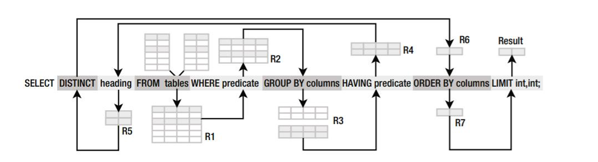

```{r setup, include = FALSE}
# general options --------------------------------------------------------------
options(scipen = 999)
options(htmltools.preserve.raw = FALSE)
set.seed(42)
# chunk options ----------------------------------------------------------------
knitr::opts_chunk$set(
  cache.extra = knitr::rand_seed, 
  message = FALSE, 
  warning = FALSE, 
  error = FALSE, 
  echo = FALSE,
  cache = FALSE,
  comment = "", 
  fig.align = "center", 
  fig.retina = 3
  )
# libraries --------------------------------------------------------------------
library(tidyverse)
library(knitr)
library(nomnoml)
library(emo)
library(DiagrammeR)
library(widgetframe)
```

# Big Data Everywhere!

```{r out.width='50%'}
include_graphics("https://www.visualcapitalist.com/wp-content/uploads/2019/07/big-data-getting-bigger.jpg")
```

---

# What are Big Data?

### Definition

The term Big Data corresponds to a table containing observations (i.e. database or dataset) that is **too long, too large or too complex to be handled by conventional tools**

### Microsoft Excel's Limits (v16.44 - Office 365):

- Total number of rows: **1,048,576 rows**
- Total number columns: **16,384 columns**

.pull-left[
```{r out.width='60%'}
include_graphics("https://qph.fs.quoracdn.net/main-qimg-e4072574da0c7a785bc4b138b694189f")
```
]
.pull-right[
*Have you ever tried to scroll down to the end of Excel? Because I did!*
]

---

# Data vs. Information

Without data, an organization could not successfully complete most business activities. However, organisations need to convert these data into meaningful information

- Data consists of raw facts
- Information is often confused with the term data

### Example: Sales Manager
- Knowing number of sales for each representative (fact – data)
- Knowing total monthly sales (transformed – information)

```{nomnoml, fig.width=12, fig.height=3}
#stroke: black
#direction: right
#align: center
[Data]->[Transformation Process]
[Transformation Process]->[Information]
```

---

# Value of Information

- **Goals**: Helps decision makers achieve organisational goals
- **Performance**: Valuable information helps people and organisations perform
- **Accuracy**: Inaccurate/Incomplete information leads to Poor Decisions and can result in High Cost for the organisation 

--

### Data Analytics
- The science of using data to build models that lead to better decisions that in turn add value to individuals, companies and institutions
- The analysis of data, typically large sets of data, by the use of mathematics, statistics, and computer software

```{r}
#| fig.cap: "Data analytics provides an integrated view of business performance."
DiagrammeR::grViz("
  digraph {
    'Business performance results' -> 'What happened?' [dir = both]
    'Business performance results' -> 'Why did it happen?' [dir = both]
    'Business performance results' -> 'What do we want to happen?' [dir = both]
  }", width = 800, height = 150)
```

---

# Data Analytics in Organisations

```{r out.width='60%'}
#| fig.cap: "Overview of Data Analytics in Organisations"
include_graphics("img/organisation_structure.jpg")
```
.center.tiny[Laursen and Thorlund (2017) Business Analytics for Managers [`r emo::ji("link")`](https://capitadiscovery.co.uk/dcu/items/dda-27/EBC4714241?query=Business+Analytics+for+Managers&resultsUri=items%3Fquery%3DBusiness%2BAnalytics%2Bfor%2BManagers)]

---

# Competitive Advantages

```{r out.width='60%'}
#| fig.cap: "An investment in data analytics needs to increase profits if it is to generate a return on investment"
include_graphics("img/strategic_importance.png")
```
.center.tiny[Williams (2016) Business Intelligence Strategy and Big Data Analytics [`r emo::ji("link")`](https://capitadiscovery.co.uk/dcu/items/1021702?query=Business+Intelligence+Strategy+and+Big+Data+Analytics&resultsUri=items%3Fquery%3DBusiness%2BIntelligence%2BStrategy%2Band%2BBig%2BData%2BAnalytics)]

Whether the goal is improved enhanced customer service, reduced operating costs, or any other improvement initiative; success demands:
- A very skilful general management and change management
- A clear vision of the desired future state
- A compelling strategic argument for achieving the future state

---

# Strategic Importance of Data Analytics

Over the past 20 years, Data Analytics has proven to be highly useful in improving many different business processes:

- Management processes—like strategic planning, budgeting, performance measurement, controlling, and performance variance analysis.

- Revenue generation processes—like market research, customer segmentation, sales planning, revenue budgeting and management,
pricing, promotions planning and execution, product development, service development, customer order processing, and so forth.

- Operating processes—like purchasing, supplier management, inbound logistics, manufacturing, operations, inventory management,
distribution centre management, outbound logistics, quality assurance, order fulfilment, customer service, and so forth.

A well-designed BI environment serves as a powerful multifaceted tool for performance measurement and process improvement.

---

# Strategic Importance of Data Analytics

```{r out.width='60%'}
#| fig.cap: "Opportunities to leverage Data Analytics within the core processes that drive business results."
include_graphics("img/data_analytics_opportunities.png")
```
.center.tiny[Williams (2016) Business Intelligence Strategy and Big Data Analytics [`r emo::ji("link")`](https://capitadiscovery.co.uk/dcu/items/1021702?query=Business+Intelligence+Strategy+and+Big+Data+Analytics&resultsUri=items%3Fquery%3DBusiness%2BIntelligence%2BStrategy%2Band%2BBig%2BData%2BAnalytics)]

---

# Styles of Data Analytics

It uses a combination of historical information about past transactions or events and reference data about, for example, customers or products, to enable a wide variety of analyses and decision support techniques.

- **Standard Reports:** Preformatted information for predefined backward-looking analysis. 

- **Academic Reports:** Application of research methods to business information  using descriptive and inferential statistics.

- **Dashboards:** Business performance metrics using specific variables presented in a tabular or graphical format.

- **Alerts:** Communication to designated business people when a key business variable is outside a predefined performance standard or range.

- **Predictive Analytics:** Application of historical business information to predict future the performance and potentially prescribe a favoured course of action.

---

# Data Analytics in Academic Reports

Standard Reports can be insufficient tools to validate the results provided by Data Analytics. To insure the robustness of the insights generated, Academic Reports are structured around the Hypothetico-Deductive model.

In Academic Reports rep all sections are linked:

.center[**Introduction `r ji("right_arrow")` Literature Review `r ji("right_arrow")` Method `r ji("right_arrow")` Results `r ji("right_arrow")` Discussion & Conclusion**]

--

To understand the statistics in the results section it is essential to identify the concepts presented in each section:

```{nomnoml, fig.width=12, fig.height=3}
#stroke: black
#direction: right
#align: center
[Introduction | Variables]->[Literature Review | Hypotheses]
[Literature Review | Hypotheses]->[Method | Model & Equation]
[Method | Model & Equation]->[Results | Statistical Test]
[Results | Statistical Test]->[Discussion & Conclusion | Interpretation]
```

.center.tiny[See Pries and Dunnigan (2015) BIG DATA ANALYTICS: A Practical Guide for Managers Chapter 6[`r emo::ji("link")`](https://capitadiscovery.co.uk/dcu/items/1020628?query=%22DATA+ANALYTICS%22&resultsUri=items%3Fquery%3D%2522DATA%2BANALYTICS%2522)]

---

# Data Analytics Tasks

```{r out.width='80%'}
include_graphics("https://d33wubrfki0l68.cloudfront.net/571b056757d68e6df81a3e3853f54d3c76ad6efc/32d37/diagrams/data-science.png")
```

### Techniques and tools used in this module

- Import Data with SQL
- Tidy and Transform Data with MS Excel
- Visualise and Model Data with Jamovi
- Communicate with MS Word

---
class: inverse, mline, center, middle

# 1. Data Storage

---

# The Hierarchy of Data

```{r out.width='80%'}
include_graphics("https://squagoals.weebly.com/uploads/5/7/5/6/57565411/5440736.jpg?325")
```

---

# Database Access

### When building a database, organizations must consider

- **Content**: What data should be collected and at what cost?
- **Access**: What data should be provided to which users and when?
- **Logical** structure: How should data be arranged so that it makes sense to a given user

### To allow multiple simultaneous access to the database

- Hosted on a remote “cloud” server (usually)
- Database client manager including Host Address (IP or URL) and Guest Access (TCP Port and Login/password)

As previously mentioned, databases can contain a huge amount of data and tables can contains billions of observations. Therefore, **the aim of accessing a database is to subset a table to obtain only the relevant data by querying the database**. Then, the data obtained can be processed by another tool

---

# Relational Database

.pull-left[

Observations are related between tables using a shared **key variable**

### Example

Table Customers and table Orders contain the same CustomerID variable
Table Orders and table Order Details contain the same OrderID variable
]

.pull-right[
```{r out.width='100%'}
include_graphics("img/northwind_relationships.png")
```
]

---

# Relational Database

```{r out.width='90%'}
include_graphics("https://www.databasejournal.com/img/2010/08/04fig09.jpg")
```

.center[Structure, also called schema, of the Northwind Company database]

---

# Database Schema

The database structure, or schema, describes:

- All tables and all variables
- Relationship between tables

The schema is crucial to enabling retrieval of desired data. Therefore the structure of the database must be understood for accurate querying. A wrong understanding  of its structure can lead to wrong results.

```{r out.width='50%'}
include_graphics("https://external-preview.redd.it/eWJ9RiTdWLJAyW8R7AuX0HGijt10i9SpSEXL55Iy_Uw.jpg?auto=webp&s=6ccfe1cf8e0d2827d8809c3823a332c3c7b26074")
```

---
class: inverse, mline, center, middle

# 2. Data Access

---

# Database Queries

Database can be made of millions/billions data spread on hundreds of tables/files

A Query is a set of instructions to retrieve, sort and format returning data

- Extracting information out of the database to process them (e.g., with MS Excel)
- E.g., “find me all customers in my database”

Structured Query Language (SQL) is the language to query a database and to obtain one file with the information you need only

This is the main SQL statement you need to understand for querying:

```{sql, eval=FALSE, echo=TRUE}
SELECT *
FROM table_name;
```

Translation: **Show me the data from all the variables in the table 'table_name'**

---

# Basic Syntax of SQL Query

1. Always starts with SELECT followed by * (all variables) or by the variables to select

2. Always indicates FROM after SELECT followed by the table name

3. Always finishes with a Semicolon

---

# Basic Syntax of SQL Query

```{sql, eval=FALSE, echo=TRUE}
SELECT variable_1, variable_2
FROM table_name;
```

Translation: 
- **Show me the data only from the variables 'variable_1' and 'variable_2' ...**
- **... in the table 'table_name'**

Example when querying the Northwind database:

```{sql, eval=FALSE, echo=TRUE}
SELECT ProductID, ProductName
FROM Products;
```

Translation: 
- **Show me the data only from the variables 'ProductID' and 'ProductName' ...**
- **... in the table 'Products'**

---

# Filter a table with SQL

The statement WHERE indicates which observation to keep

It is a logical statement:
- All conditions that are FALSE are discarded
- All conditions that are TRUE are kept

Example when querying the Northwind database:

```{sql, eval=FALSE, echo=TRUE}
SELECT ProductID, ProductName
FROM Products
WHERE ProductName = 'macbook';
```

Translation: 
- **Show me the data only from the variables 'ProductID' and 'ProductName' ...**  
- **... in the table 'Products' ... **  
- **... but only if the product is a macbook**

---

# More Possibilities with SQL

More functions can be added, such as:

- DISTINCT: keep unique observations only
- GROUP BY: aggregate data for similar observations
- HAVING: condition with mathematical calculation
- ORDER BY: sort observations
- LIMIT: keep only a certain amount of observations
- ...

```{r out.width='100%'}

```

Words of Caution: Easy to build queries that retrieve nonsense, never complete, or end up completely bogging down the database. Understanding Schema is a way to prevent that

---

# Convert Data to Information

When the relevant data have been subset from a database, it is possible to save them in a smaller spreadsheet file to be processed in other software

Possible file format to save data from queries:

```{r}
tribble(
  ~Format, ~Usecase, ~Reason,
  ".json", "Only for computer engineers/developers", "JavaScript Object Notation (https://www.json.org/), semi-structured data file",
  ".csv", "Must be the default", "Comma Separated Value is the most common data format. Open and light",
  ".xls or .xlsx", "Never", "MS Excel format (not open-source) which contains interface, metadata and figures. To avoid"
  ) %>% 
  kable()
```

However, in organisations it is usual to use data that are directly stored in MS Excel files:

- Local only (except if stored in an online "cloud" repository)
- No update possible if stored locally
- Can be very messy and unstructured

---

# What's Next?

SQL is not part of any assignment for the module but is essential to add to your CV. Improve your knoweldge with the following free online training: https://www.udemy.com/course/introduction-to-databases-and-sql-querying/

```{r out.width='50%'}
include_graphics("img/board_database.png")
```

---
class: inverse, mline, left, middle


# Thanks for your attention and don't hesitate to ask if you have any question!

[`r fontawesome::fa(name = "twitter")` @damien_dupre](http://twitter.com/damien_dupre)  
[`r fontawesome::fa(name = "github")` @damien-dupre](http://github.com/damien-dupre)  
[`r fontawesome::fa(name = "link")` damien-datasci-blog.netlify.app](https://damien-datasci-blog.netlify.app)  
[`r fontawesome::fa(name = "paper-plane")` damien.dupre@dcu.ie](mailto:damien.dupre@dcu.ie)
