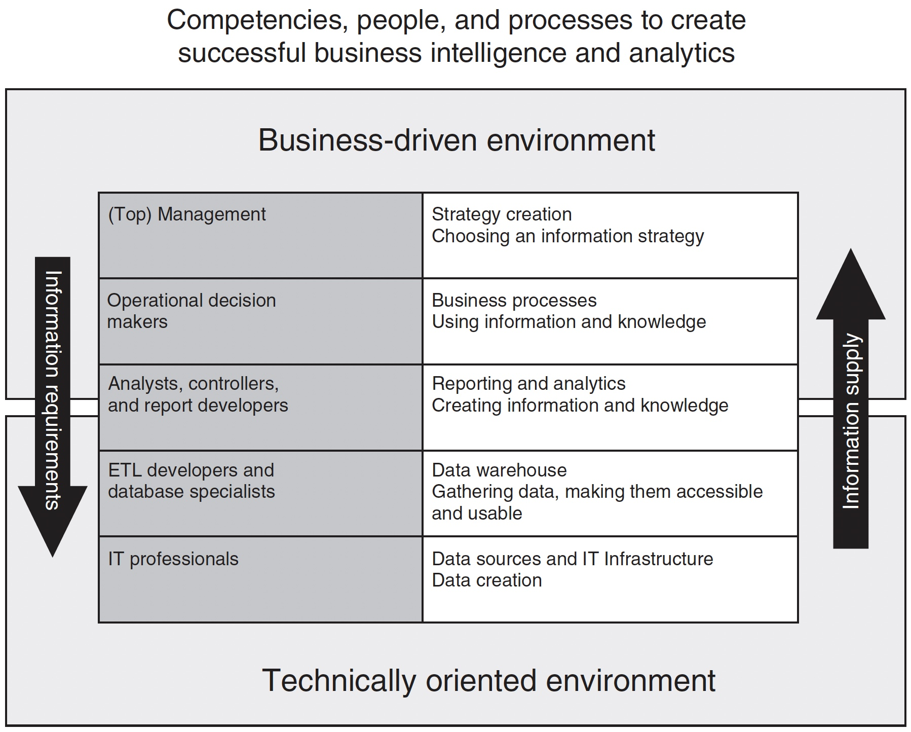
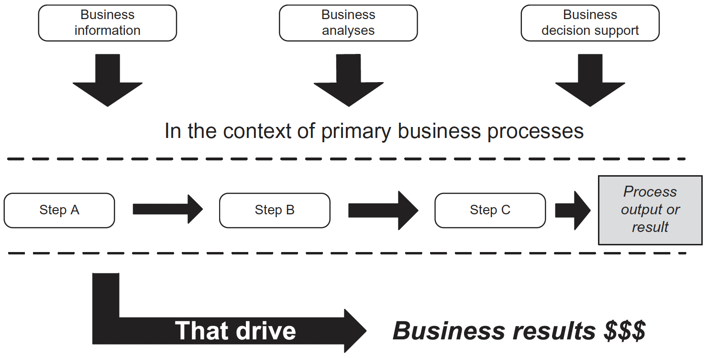
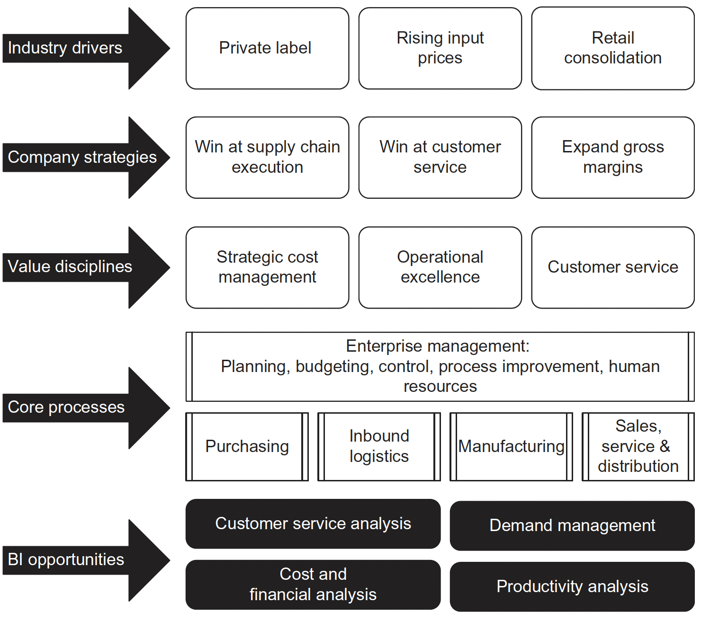

```{r setup, include = FALSE}
# general options --------------------------------------------------------------
options(scipen = 999)
options(htmltools.preserve.raw = FALSE)
set.seed(42)
# chunk options ----------------------------------------------------------------
knitr::opts_chunk$set(
  cache.extra = knitr::rand_seed, 
  message = FALSE, 
  warning = FALSE, 
  error = FALSE, 
  echo = FALSE,
  cache = FALSE,
  comment = "", 
  fig.align = "center", 
  fig.retina = 3
  )
# libraries --------------------------------------------------------------------
library(tidyverse)
library(knitr)
library(nomnoml)
library(emo)
library(DiagrammeR)
library(widgetframe)
```

# Module Contact Details


.pull-left[
**Strategic Consultancy Project I**

Dr. John Loonam

john.loonam@dcu.ie

<br />
<br />

**Data Analytics**

Dr. Damien Dupré

damien.dupre@dcu.ie
]

.pull-right[
```{r}
knitr::include_graphics("https://business.dcu.ie/wp-content/uploads/2019/04/dr_john_loonam160x160.jpg")
```

<br />

```{r, out.width = "42%"}
knitr::include_graphics("https://img.rasset.ie/00166efb-300.jpg")
```

]

---

# About Me

#### Development of the DynEmo Facial Expression Database (Master)
- Dynamic and spontaneous emotions
- Assessed with self-reports and by observers

#### Analysis of Emotional User Experience of Innovative Tech. (Industrial PhD)
- Understand users' acceptance of technologies from their emotional response
- Based on multivariate self-reports

#### Evaluation of Emotions from Facial and Physiological Measures (Industrial PostDoc)
- Applications to marketing, sports and automotive industries
- Dynamic changes with trend extraction techniques (2 patents)

#### Performance Prediction using Machine Learning (Academic PostDoc)
- Application to sport analytics
- Big Data treatment (> 1 million users with activities recorded in the past 5 years)

---

# Public

.pull-left[
.center[
**Sinéad**

```{r}

```

Product Manager in a Multinational Company

Knowledge of Statistics from Previous Master Degree
]
]

.pull-right[
.center[
**Patrick**
```{r}

```

Business Development Manager in an Irish Unicorn

Master Microsoft Excel
]
]

### .center[Their common aim: To scale up to understand and challenge analyses from their data team]

---

# Learning Outcomes

1. Have insight into the concepts and role of big data and data analytics in business and in management decision making

2. Understand, evaluate and apply qualitative and quantitative research methods tools and techniques

3. Understand and interpret data visualisation outputs and analytics reports

---

# Module Content

#### Introduction to Data Analytics (DD)
- Growth of Big Data: Data Analytics for Business & Management Decision Making

#### Research Design (DD & JL)
- Introduction to qualitative and quantitative research methods and skills

#### Writing a Research Proposal (JL)
- Role of literature review; research question; contributing to theory and practice

#### Data Analysis Workshops (DD)
- Qualitative/Quantitative data analysis

#### Data Interpretation (DD & JL)
- Interpreting qualitative and quantitative data; data visualisation & reports

#### Group Presentations (JL)
- Research Proposals; Feedback

---

# Assessment Structure

### 100% Continuous divided in:

- #### Strategic Consultancy Project (30%): Group Assessment 

- #### Data Analytics  (70%): Individual Assessment: Data Analytic Report

### Data Analytics Assessment

- Write-up a report fully documenting the results of a systematic quantitative analysis of a dataset (send to you by email in January)

- This will require the use of a statistical software (e.g., JAMOVI)

- You will illustrate your understanding about the full quantitative analysis process including: 
 - Running descriptive statistics, including tables and graphics
 - Assessing multi-item scale internal reliability (Cronbach’s alpha)
 - Using bivariate and multivariate inferential statistics
 
---

# Data Analytics Assessment Deadline

### Individual Assignments should be submitted no later than **June 21st, 2022** by 12pm.

### Submission via MT5125’s Loop page.

### Late assignments are not allowed

---

# Data Analytics Plan

### Thur. 14/10/21 (2h) 
Introduction

### Thur. 21/10/21 (2h)
Variables and Hypotheses

### Sat. 27/11/21 (7h)
Data: Access, Cleaning, and Transformations

### Sat. 19/02/22 (7h)
Descriptive Analytics and Inferential Statistics

### Thur. 03/03/22 (2h)
Quantitative vs. Qualitative Analyses

---
class: inverse, mline, center, middle

# Data Analytics in Organisations

---

# Big Data Everywhere!

```{r out.width='50%'}
include_graphics("https://www.visualcapitalist.com/wp-content/uploads/2019/07/big-data-getting-bigger.jpg")
```

---

# What are Big Data?

### Definition

The term Big Data corresponds to a table containing observations (i.e. database or dataset) that is **too long, too large or too complex to be handled by conventional tools**

### Microsoft Excel's Limits (v16.44 - Office 365):

- Total number of rows: **1,048,576 rows**
- Total number columns: **16,384 columns**

.pull-left[
```{r out.width='60%'}
include_graphics("https://qph.fs.quoracdn.net/main-qimg-e4072574da0c7a785bc4b138b694189f")
```
]
.pull-right[
*Have you ever tried to scroll down to the end of Excel? Because I did!*
]

---

# Data vs. Information

Without data, an organization could not successfully complete most business activities. However, organisations need to convert these data into meaningful information

- Data consists of raw facts
- Information is often confused with the term data

### Example: Sales Manager
- Knowing number of sales for each representative (fact – data)
- Knowing total monthly sales (transformed – information)

```{nomnoml, fig.width=12, fig.height=3}
#stroke: black
#direction: right
#align: center
[Data]->[Transformation Process]
[Transformation Process]->[Information]
```

---

# Value of Information

- **Goals**: Helps decision makers achieve organisational goals
- **Performance**: Valuable information helps people and organisations perform
- **Accuracy**: Inaccurate/Incomplete information leads to Poor Decisions and can result in High Cost for the organisation 

--

### Data Analytics
- The science of using data to build models that lead to better decisions that in turn add value to individuals, companies and institutions
- The analysis of data, typically large sets of data, by the use of mathematics, statistics, and computer software

```{r}
#| fig.cap: "Data analytics provides an integrated view of business performance."
DiagrammeR::grViz("
  digraph {
    'Business performance results' -> 'What happened?' [dir = both]
    'Business performance results' -> 'Why did it happen?' [dir = both]
    'Business performance results' -> 'What do we want to happen?' [dir = both]
  }", width = 800, height = 150)
```

---

# Data Analytics in Organisations

```{r out.width='60%'}
#| fig.cap: "Overview of Data Analytics in Organisations"

```
.center.tiny[Laursen and Thorlund (2017) Business Analytics for Managers [`r emo::ji("link")`](https://capitadiscovery.co.uk/dcu/items/dda-27/EBC4714241?query=Business+Analytics+for+Managers&resultsUri=items%3Fquery%3DBusiness%2BAnalytics%2Bfor%2BManagers)]

---

# Competitive Advantages

```{r out.width='60%'}
#| fig.cap: "An investment in data analytics needs to increase profits if it is to generate a return on investment"

```
.center.tiny[Williams (2016) Business Intelligence Strategy and Big Data Analytics [`r emo::ji("link")`](https://capitadiscovery.co.uk/dcu/items/1021702?query=Business+Intelligence+Strategy+and+Big+Data+Analytics&resultsUri=items%3Fquery%3DBusiness%2BIntelligence%2BStrategy%2Band%2BBig%2BData%2BAnalytics)]

Whether the goal is improved enhanced customer service, reduced operating costs, or any other improvement initiative; success demands:
- A very skilful general management and change management
- A clear vision of the desired future state
- A compelling strategic argument for achieving the future state

---

# Strategic Importance of Data Analytics

Over the past 20 years, Data Analytics has proven to be highly useful in improving many different business processes:

- Management processes—like strategic planning, budgeting, performance measurement, controlling, and performance variance analysis.

- Revenue generation processes—like market research, customer segmentation, sales planning, revenue budgeting and management,
pricing, promotions planning and execution, product development, service development, customer order processing, and so forth.

- Operating processes—like purchasing, supplier management, inbound logistics, manufacturing, operations, inventory management,
distribution centre management, outbound logistics, quality assurance, order fulfilment, customer service, and so forth.

A well-designed BI environment serves as a powerful multifaceted tool for performance measurement and process improvement.

---

# Strategic Importance of Data Analytics

```{r out.width='60%'}
#| fig.cap: "Opportunities to leverage Data Analytics within the core processes that drive business results."

```
.center.tiny[Williams (2016) Business Intelligence Strategy and Big Data Analytics [`r emo::ji("link")`](https://capitadiscovery.co.uk/dcu/items/1021702?query=Business+Intelligence+Strategy+and+Big+Data+Analytics&resultsUri=items%3Fquery%3DBusiness%2BIntelligence%2BStrategy%2Band%2BBig%2BData%2BAnalytics)]

---

# Styles of Data Analytics

It uses a combination of historical information about past transactions or events and reference data about, for example, customers or products, to enable a wide variety of analyses and decision support techniques.

- **Standard Reports:** Preformatted information for predefined backward-looking analysis. 

- **Academic Reports:** Application of research methods to business information  using descriptive and inferential statistics.

- **Dashboards:** Business performance metrics using specific variables presented in a tabular or graphical format.

- **Alerts:** Communication to designated business people when a key business variable is outside a predefined performance standard or range.

- **Predictive Analytics:** Application of historical business information to predict future the performance and potentially prescribe a favoured course of action.

---

# Data Analytics in Academic Reports

Standard Reports can be insufficient tools to validate the results provided by Data Analytics. To insure the robustness of the insights generated, Academic Reports are structured around the Hypothetico-Deductive model.

In Academic Reports, all sections are linked:

.center[**Introduction `r ji("right_arrow")` Literature Review `r ji("right_arrow")` Method `r ji("right_arrow")` Results `r ji("right_arrow")` Discussion & Conclusion**]

--

To understand the statistics in the results section it is essential to identify the concepts presented in each section:

```{nomnoml, fig.width=12, fig.height=3}
#stroke: black
#direction: right
#align: center
[Introduction | Variables]->[Literature Review | Hypotheses]
[Literature Review | Hypotheses]->[Method | Model & Equation]
[Method | Model & Equation]->[Results | Statistical Test]
[Results | Statistical Test]->[Discussion & Conclusion | Interpretation]
```

.center.tiny[See Pries and Dunnigan (2015) BIG DATA ANALYTICS: A Practical Guide for Managers Chapter 6[`r emo::ji("link")`](https://capitadiscovery.co.uk/dcu/items/1020628?query=%22DATA+ANALYTICS%22&resultsUri=items%3Fquery%3D%2522DATA%2BANALYTICS%2522)]

---
class: inverse, mline, left, middle


# Thanks for your attention and don't hesitate to ask if you have any question!

[`r fontawesome::fa(name = "twitter")` @damien_dupre](http://twitter.com/damien_dupre)  
[`r fontawesome::fa(name = "github")` @damien-dupre](http://github.com/damien-dupre)  
[`r fontawesome::fa(name = "link")` damien-datasci-blog.netlify.app](https://damien-datasci-blog.netlify.app)  
[`r fontawesome::fa(name = "paper-plane")` damien.dupre@dcu.ie](mailto:damien.dupre@dcu.ie)