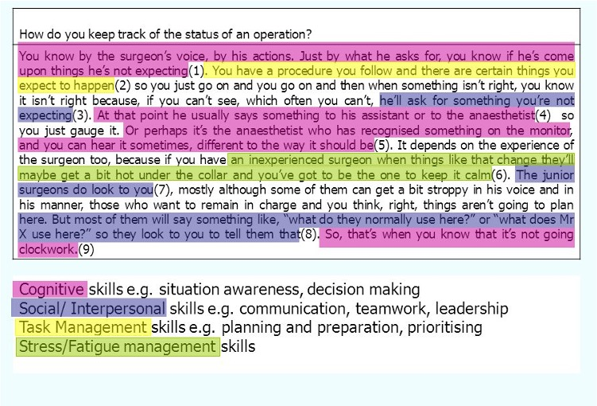

```{r setup, include = FALSE}
# libraries --------------------------------------------------------------------
library(countdown)
library(fontawesome)
library(knitr)

# chunk options ----------------------------------------------------------------
opts_chunk$set(
  echo = FALSE,
  fig.align = "center", 
  fig.retina = 3
  )
```

# Qualitative Research

Not every research is about scales and statistics, more qualitative research are also very informative.

--

Qualitative research can be defined as the study of the **nature** of phenomena and is especially appropriate for answering questions of **why something is observed**, assessing complex multi-component interventions, and **focussing on intervention improvement**. 

--

The most common methods of data collection are document study, observations, interviews and focus groups. 

--

For data analysis, field-notes and audio-recordings are transcribed into protocols and transcripts, and coded using qualitative data management software.

--

Using **qualitative in addition to quantitative** research is probably the best approach to understand and solve a problem.

---
class: inverse, mline, center, middle

# 1. Qualitative Techniques

---
class: title-slide, middle

## Interviews

---

# Interviews

### Unstructured
> No set agenda, no (or few) prepared questions

### Semi-structured
> Themes and questions known but questions and order may change depending on flow of interview

### Structured 
> Predetermined standardised questions in consistent sequence

---

# Interview Guide

Set your guidelines to have a reproducible method:

- Who to interview – self selection
- Interviewer’s/interviewee’s level of knowledge
- Level of information supplied to interviewees
- Appropriateness of location
- Confidentiality
- Recording
- Researcher’s appearance – dress code
- Approach to questioning – clarity and reducing bias
- Use of critical incident technique: ask for examples

```{r out.width='60%'}
include_graphics("https://www.mastersindatascience.org/wp-content/uploads/Tech-Interview-Guide-for-2020-hero-2.jpg")
```

---

# Kinds of Question

### Introducing questions
> **Please tell me about when your interest in X first began?**; **Have you ever . . .?**; **Why did you go to ...?**

### Follow-up questions
> Getting the interviewee to elaborate his/her answer, such as **Could you say some more about that?**; **What do you mean by that?**; **Can you give me an example?** even **Yeeees?**

### Probing questions
> Following up what has been said through direct questioning.

### Specifying questions
> **What did you do then?**; **How did X react to what you said?**

---

# Kinds of Question

### Silence
> Allow pauses to signal that you want to give the interviewee the opportunity to reflect and amplify an answer.

### Interpreting questions
> **Do you mean that your leadership role has had to change from one of encouraging others to a more directive one?**; **Is it fair to say that what you are suggesting is that you don't mind being friendly towards customers most of the time, but when they are unpleasant or demanding you find it more difficult?**

### Leading questions
> To be avoided, examples: **How have your experiences as a teacher affected you as a parent?**; **Did you believe that the recent lay-offs in your department were unnecessary?**

---

# Criteria for Successful Interviewers

- **Knowledgeable**:  thoroughly familiar with the focus of the interview; pilot interviews are useful here.

- **Structuring**: gives purpose for interview; rounds it off; asks whether interviewee has questions.

- **Clear**: asks simple, easy, short questions; no jargon.

- **Gentle**: lets people finish; gives them time to think; tolerates pauses.

- **Sensitive**: listens attentively to what is said and how it is said; is empathetic in dealing with the interviewee.

---

# Criteria for Successful Interviewers

- **Critical**: is prepared to challenge what is said, for example, dealing with inconsistencies in interviewees' replies.

- **Remembering**: relates what is said to what has previously been said.

- **Interpreting**: clarifies and extends meanings of interviewees' statements, but without imposing meaning on them.

- **Balanced**: does not talk too much, which may make the interviewee passive, and does not talk too little, which may result in the interviewee feeling he or she is not talking along the right lines.

---
class: title-slide, middle

## Focus Groups

---

# The Focus Group Method

The focus group method is a form of group research where: 

- There are several participants (in addition to the moderator/ facilitator)

- There is an emphasis on questioning on a particular, fairly tightly defined topic 

- Emphasis on interaction within the group and the joint construction of meaning

Size of Groups:

- Typical group size is six to ten 

- More than eight difficult to manage 

- It is almost impossible to control for `no-shows' other than by consciously over-recruiting 

- Larger groups make it  more difficult to stimulate discussion especially if people are reluctant to talk about a topic or have little experience of it

---

# An Example of a Focus Group Agenda

## Introduction (15 min)

- Introduce yourself, the research and roles
- Aim and format of the focus group
- Conventions (confidentiality, speak one at a time, recordings, everybody’s views
- Personal introduction of participants and their businesses
- Introduce the first topic

## Discussion Topics

- Current trading climate (15  min)
- Main challenges in the business environment (20 min)
- Government policies and small firms (20 min)
- Topical issues (20 min)

---

# Focus Groups

.pull-left[
## Pros

- Are flexible

- Provide insights into people’s shared understandings of everyday life

- The synergistic group effect

- Candour of participants

- Timing and cost
]

.pull-right[
## Cons

- Difficult to organise

- Researcher’s control is limited

- Transcription of discussions can be difficult

- Data difficult to analyse

- Not always appropriate for participants
]

---
class: inverse, mline, center, middle

# 2. Analysing Qualitative Data

---

# Working with Interviews

Steps:

1. Create questions according to hypotheses

2. Identify and recruit representative participants

3. Interview audio recording

4. Transcription (speech to text)

5. Define Coding Scheme

6. Analyse Interview according to the coding scheme

---

# Thematic Analysis

>*“working with data, organizing it, breaking it into manageable units, synthesising it, searching for patterns, discovering what is important and what is to be learned, and deciding what you will tell others.”* (Bogdan and Biklen, 1982)

## Objective

To determine the categories, relationships, and assumptions that underpin respondents’ views of the world in general & of the subject matter of interest in particular

## Coding Scheme

Codes are tags or categories attached to words, phrases, sentences or paragraphs connected to a category/theme.

Method of organising and structuring data according to issues and topics identified by research participants as being important to understanding the phenomenon of interest 

---

# Coding Scheme

```{r out.width='50%'}

```

---

# Coding Scheme Advice

### Code as soon as possible 

### Read through your initial set of transcripts

### Do it again and create list of codes

### Review and refine your codes 

### Consider more general theoretical ideas in relation to data 

### Items or slice of data can be coded in more than one way 

### Do not worry about generating too many codes

---

# Coding Example

```{r out.width='100%'}

```

---

# Coding Example

```{r out.width='70%'}

```


---
class: title-slide, middle

## Interview Analysis Example

Topic: Cultural engagement in a complex business environment

---

# Procedure

**Briefing**: Thank him/her for participation, introduce myself (name and profession), define the situation for the interviewee (confidentiality, recording, about 50 minutes, plus a short discussion afterwards), briefly state the purpose of the interview, and asking if the interviewee has any questions before the interview

**Introduction**: Can you tell me a bit about yourself, and your responsibility at Radiometer?

**Question related to the "Internal Complexity" topic**

- Complexity 1: How often do you find yourself in cross-cultural encounters?
- Complexity 2: In your experience, how might culture play a role when we talk about solving tasks? Could you give an example?

**Question related to the "Intercultural Engagement" topic**

- IE 1: How do you feel about engaging in cross-cultural collaborations?
- IE 2: Can you describe a meeting with someone different from you that turned out just the way you wanted to?

**Debriefing**: Are there any more things you would like to say before we end the interview? May I contact you, if further questions should arise? Thank you for your cooperation.

---

# Interview Analysis Example

```{r out.width='100%'}

```

```{r out.width='100%'}

```

---

# Interview Analysis Example

```{r out.width='100%'}

```

```{r out.width='100%'}

```

---

# Interview Analysis Example

```{r out.width='100%'}

```

```{r out.width='100%'}

```

---

# Interview Analysis Example

```{r out.width='100%'}

```

```{r out.width='100%'}

```

---

# Interview Analysis Example

```{r out.width='100%'}

```

```{r out.width='100%'}

```

---

# Interview Analysis Example

```{r out.width='100%'}

```

```{r out.width='100%'}

```

---
class: title-slide, middle

## Qualitative Analysis Software

---

# NVivo (not free)

```{r out.width='100%'}

```

---

# QDA Miner (free version)

```{r out.width='100%'}

```

---

# QDA Miner (free version)

```{r out.width='100%'}

```

---
class: inverse, mline, left, middle


# Thanks for your attention and don't hesitate to ask if you have any question!

[`r fa(name = "twitter")` @damien_dupre](http://twitter.com/damien_dupre)  
[`r fa(name = "github")` @damien-dupre](http://github.com/damien-dupre)  
[`r fa(name = "link")` damien-datasci-blog.netlify.app](https://damien-datasci-blog.netlify.app)  
[`r fa(name = "paper-plane")` damien.dupre@dcu.ie](mailto:damien.dupre@dcu.ie)


