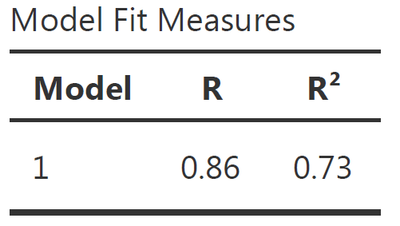
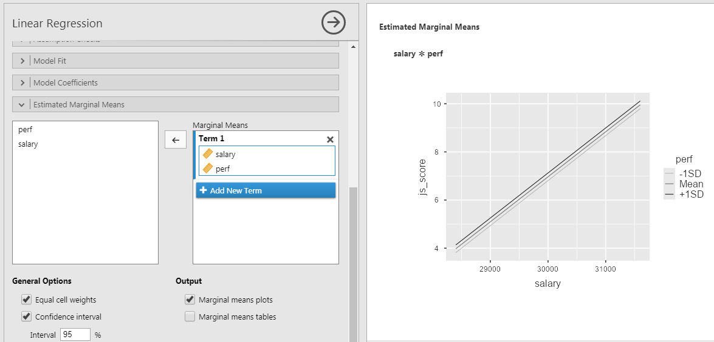
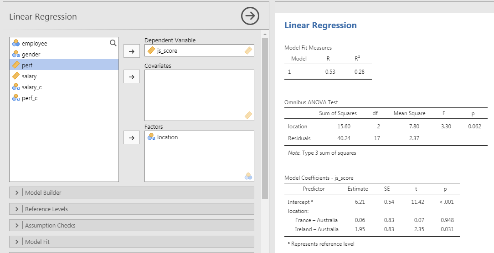

```{r setup, include = FALSE}
# general options --------------------------------------------------------------
options(
  scipen = 999,
  htmltools.preserve.raw = FALSE
  )
set.seed(123)
# chunk options ----------------------------------------------------------------
knitr::opts_chunk$set(
  cache.extra = knitr::rand_seed, 
  message = FALSE, 
  warning = FALSE, 
  error = FALSE, 
  echo = FALSE,
  cache = FALSE,
  comment = "", 
  fig.align = "center", 
  fig.retina = 3
  )
# libraries --------------------------------------------------------------------
library(tidyverse)
library(fontawesome)
library(DiagrammeR)
library(patchwork)
library(ggrepel)
library(papaja)
library(knitr)
library(kableExtra)
library(countdown)

# data -------------------------------------------------------------------------
dnd <- readr::read_csv(here::here("data/dnd.csv"))  

  # tibble::tibble(
  #   gender = sample(c("male", "female"), 20, replace = TRUE),
  #   location = sample(c("Ireland", "France", "Australia"), 20, replace = TRUE),
  #   perf = rnorm(20, mean = 4, sd = 2),
  #   salary = rnorm(20, mean = 30000, sd = 1000),
  #   js_score = -55 + 0.002 * salary + rnorm(20, mean = 2, sd = 1)
  # ) %>%
  # tibble::rownames_to_column("employee") %>%
  # dplyr::mutate(
  #   js_score = case_when(
  #     js_score > 10 ~ 10,
  #     js_score < 0 ~ 0,
  #     TRUE ~ js_score
  #   ),
  #   perf = case_when(
  #     perf > 10 ~ 10,
  #     perf < 0 ~ 0,
  #     TRUE ~ perf
  #   ),
  #   salary_c = case_when(
  #     salary >= mean(salary) ~ "high",
  #     salary < mean(salary) ~ "low"
  #   ),
  #   perf_c = case_when(
  #     perf >= mean(perf) + sd(perf) ~ "high",
  #     perf < mean(perf) + sd(perf) & perf >= mean(perf) - sd(perf) ~ "medium",
  #     perf < mean(perf) - sd(perf) ~ "low"
  #   ),
  # ) %>%
  # readr::write_csv(here::here("data/dnd.csv"))

# analyses ---------------------------------------------------------------------
m_js_high <- mean(dnd$js_score[dnd$salary_c == "high"])
m_js_low <- mean(dnd$js_score[dnd$salary_c == "low"])
lm_1 <- lm(js_score ~ salary, data = dnd) %>% apa_print
lm_2 <- lm(js_score ~ salary*perf, data = dnd) %>% apa_print
lm_c <- lm(js_score ~ salary_c, data = dnd) %>% apa_print
lm_c2 <- dnd %>% 
  dplyr::mutate(salary_c = factor(salary_c, level = c("low", "high"))) %>% 
  lm(js_score ~ salary_c, data = .) %>% apa_print
lm_c3 <- lm(js_score ~ location, data = dnd) %>% aov %>% apa_print

```

class: inverse, mline, center, middle

# 1. Regressions for Hypothesis Testing

---

# Vocabulary

"Linear Model", "Linear Regression", "Multiple Regression" or simply "Regression" are all referring to the same model: **The General Linear Model**.

It contains:

- Only one Outcome/Dependent Variable
- One or more Predictor/Independent Variables of any type (categorical or continuous)
- Made of Main and/or Interaction Effects

$$Y = \beta_{0} + \beta_{1} . X + \beta_{2} . Z + ... + \epsilon$$

**To test the significance of the effects, only one statistical method will be used for all hypotheses types which are Linear Regressions.**

Specific tests are available for certain type of hypothesis such as T-test or ANOVA but as they are special cases of Linear Regressions, their importance is limited (see [Jonas Kristoffer Lindeløv's blog post: Common statistical tests are linear models](https://lindeloev.github.io/tests-as-linear/)).

---

# Notes on the Equations

### 1. Using Greek or Latin alphabet

$$Y = \beta_{0} + \beta_{1} . X_{1} + \epsilon \; vs. \; Y = b_{0} + b_{1} . X_{1} + e$$

### 2. Using $i$s or not

$$Y = \beta_{0} + \beta_{1} . X_{1} + \epsilon \; vs. \; Y_{i} = \beta_{0} + \beta_{1} . X_{1_{i}} + \epsilon_{i}$$

### 3. Using hats or no hats for the outcome variable

.center[ $$\hat{Y}\; or\; \hat{y}\; vs.\; Y\; or\; y$$ ]

---

# General Linear Model Everywhere

Most of the common statistical models (t-test, correlation, ANOVA; chi-square, etc.) are special cases of linear models.

This beautiful simplicity means that there is less to learn. In particular, it all comes down to $y = ax + b$ which most students know from secondary school. 

Unfortunately, stats intro courses are usually taught as if each test is an independent tool, needlessly making life more complicated for students and teachers alike.

```{r out.width = "35%"}
knitr::include_graphics("https://psyteachr.github.io/msc-data-skills/images/memes/glm_meme.png")
```

---

# Applied Example

### Imagine the following case study...

> The CEO of the D&D company has problems with his employee well-being and wants to investigate the relationship between **Job Satisfaction (js_score)**, **salary** and **performance (perf)**.

--

### Therefore the CEO formulate 3 hypotheses:

- The $js\_score$ increases when employees' $salary$ increases
- The $js\_score$ increases when employees' $perf$ increases
- The effect of $salary$ on $js\_score$ is higher for high $perf$ than for low $perf$

--

### The corresponding model is:

$$js\_score = \beta_{0} + \beta_{1}.salary + \beta_{2}.perf + \beta_{3}.salary*perf + \epsilon$$

---

# Where the Regression Line comes from?

Draw all the possible lines on the frame. The best line, also called best fit, is the one which has the lowest amount or error. 

.pull-left[
```{r fig.width=5, fig.height=5}
  tibble(
    salary = rnorm(200, mean = 5, sd = 5),
    js_score = -1 + 0.02 * salary + rnorm(200, mean = 2, sd = 0.1),
    b0 = rnorm(200, 0, 1),
    b1 = rnorm(200, 0.02, 0.1)
  ) %>% 
  ggplot(aes(salary, js_score)) + 
  geom_abline(aes(intercept = b0, slope = b1), alpha = 1/4) +
  geom_point() +
  theme(
    axis.text.x = element_blank(), 
    axis.text.y = element_blank(),
    text = element_text(size = 20)
  )
```
]
.pull-right[
There are 200 models on this plot, but a lot are really bad! We need to find the good models by making precise our intuition that a good model is "close" to the data. 

Therefore, we need a way to quantify the distance between the data and a model. Then we can fit the model by finding the value of $\beta_0$ and $\beta_1$ that generate the model with the smallest distance from this data.
]

---

# Best Model, Lowest Error

The error of the model (i.e., $\epsilon$) is the sum of the prediction error for each point (distance between actual value and predicted value)

For each point this specific prediction error is called **Residual**

.pull-left[
```{r fig.width=5, fig.height=5}
linear_model_1 <- lm(js_score ~ salary, dnd)

dnd$predicted <- predict(linear_model_1)   # Save the predicted values
dnd$residuals <- residuals(linear_model_1) # Save the residual values

plot_error <- dnd %>% 
  ggplot(aes(salary, js_score, label = residuals)) +
  geom_segment(aes(xend = salary, yend = predicted), color = "red") +
  geom_point() +
  geom_smooth(method = "lm", se = FALSE) +
  theme_bw() +
  theme(text = element_text(size = 20))

plotly::ggplotly(plot_error)
```
]
.pull-right[

The line which obtains the lowest error, has the smallest residuals. This line is chosen by the linear regression.

One common way to do this in statistics to use the "Mean-Square Error" (aka $MSE$) or the "Root-Mean-Square Error" (aka $RMSE$). We compute the difference between actual and predicted, square them, average them, and the take the square root for the $RMSE$. 

]

---

# Significance of Effect's Estimate

The statistical significance of an effect estimate depends on the **strength of the relationship** and on the **sample size**:

- A standardized estimate of $\beta_1 = 0.02$ can be very small but still significantly different from $\beta_1 = 0$
- Whereas a standardized estimate of $\beta_1 = 0.35$ can be stronger but in fact not significantly different from $\beta_1 = 0$

--

The significance is the probability to obtain your results with your sample knowing that there is no link between the variables in the real life:

- Also called $p$-value
- Is between 0% and 100% which corresponds to a value between 0.0 and 1.0

**If the $p$-value is lower to 5% or 0.05, then the probability to obtain your results (knowing that there is no link between the variables) is low enough to say that there must be a link between the variables.**

---

# Estimating Regression's Coefficients

As previously indicated, you will not have to calculate all the possible lines in your data to find the best fit, a software will do it for you:

- JAMOVI, JASP or SPSS have a Graphic User Interface
- R, Python or Julia are language based and have no interface

<centre>

```{r out.width = "60%"}
knitr::include_graphics("img/lm_example.png")
```

</centre>

---
class: inverse, mline, left, middle

# 2. Hypothesis with Continuous Predictor

---

# Main Effect Example

.pull-left[
### Variables
- DV = $js\_score$ (from 0 to 10)
- IV = $salary$ (from 0 to Inf.)

### Hypothesis

- $H_a$: $js\_score$ increases when $salary$ increases  (i.e., $\beta_1>0$)

- $H_0$: $js\_score$ stay the same when $salary$ increases (i.e., $\beta_1=0$)

### Equation

$$js\_score = \beta_{0} + \beta_{1} * salary + \epsilon$$
]

.pull-right[
```{r}
dnd %>% 
  dplyr::select(employee, salary, js_score) %>% 
  knitr::kable()
```
]

---

# Main Effect Example

.pull-left[
```{r fig.height=10}
dnd %>% 
  ggplot(aes(x = salary, y = js_score, label = employee)) +
  geom_point(color = "red", size = 5) +
  geom_text_repel(point.padding = 0.5, size = 14) +
  scale_y_continuous(limits = c(0, 10)) +
  theme_bw() +
  theme(text = element_text(size = 20))
```
]
.pull-right[
```{r fig.height=10}
dnd %>% 
  ggplot(aes(x = salary, y = js_score, label = employee)) +
  geom_point(color = "black", size = 5) +
  geom_smooth(method = "lm", formula = "y ~ x", size = 2, fullrange = TRUE, se = FALSE) +
  geom_hline(yintercept = mean(dnd$js_score), color = "red", size = 2) +
  scale_y_continuous(limits = c(0, 10)) +
  theme_bw() +
  theme(text = element_text(size = 20)) +
  annotate(
    "text", 
    x = 29000, 
    y = 7.5, 
    label = "H[0]:beta[1] == 0", 
    color = "red", 
    size = 6,
    parse = TRUE
  ) +
  annotate(
    "text", 
    x = 30500, 
    y = 10, 
    label = "H[1]:beta[1] > 0", 
    color = "blue", 
    size = 6,
    parse = TRUE
  )
```
]

---

# Main Effect Example

### In JAMOVI

1. Open your file
2. Set variables as continuous
3. **Analyses** > **Regression** > **Linear Regression**
4. Set $js\_score$ as DV and $salary$ as Covariates

```{r out.width = "100%"}

```
  
---

# Model Fit Measure Table

The **Model Fit Measure** table tests the prediction **accuracy of your overall model** (all predictors taken into account).

.pull-left[
- The **Model** column indicate the reference of the model in case you want to compare multiple models
]

.pull-right[
```{r out.width = "40%"}

```
]

- $R$ is the correlation between the outcome variable and all predictors taken into account (i.e., the closer to 1 or -1 the better, however in social science models with more that 0.2 or less than -0.2 are already excellent)
- $R^2$ is the % of variance from the outcome explained by the model (e.g., $R^2 = 0.73$ means the model explains 73% of the variance of the outcome variable). $R^2$ is also called **Coefficient of Determination**

Note $R \neq r$: 
- $R$ is for a model that can include multiple predictors whereas $r$ is only for 1 predictor 

---

# Model Fit Measure Table (all values)

```{r}
knitr::include_graphics("img/jamovi_mfm_full.png")
```

- $Adjusted\,R^2$ is a more conservative version of $R^2$, usually not reported
- $AIC$, $BIC$ and $RMSE$ are useful to compare multiple models, the lower the better
- **Overall Model F Test** is the statistical test to show that your model have significantly better predictions than a model without any predictor.
  - $F$ is the value of the statistical test comparing the results obtained with this sample using the full model with the results obtained with this sample using a model only with the intercept (i.e., $H_0$)
  - $df1$ is the degree of freedom "between group", its value corresponds to the amount of predictor in your model: $df1 = K$ (this is the easy explanation, see more details page 398 of "Learning Statistics with JAMOVI")
  - $df2$ is the degree of freedom "within group", its value corresponds to the amount of observation minus number of parameters minus 1: $df2 = N - K - 1$.
  - $p$ is the p-value, i.e the probability to obtain our prediction with our sample knowing that predictors have no effect in the real life (i.e., $p = P(data|H_0)$)

---

# Communicate Model Fit Measures

To communicate results about a model, APA style is a good guide. Report as follow:

$R^2 = value_{R^2}$, $F(value_{df1},value_{df2}) = value_{F}$, $p = value_{p}$

From our example:

> The predictions from the model with our predictors are significantly better than the predictions from a model without predictor ( `r lm_1$full_result$modelfit$r2`).

--

Note about p-values: 
 - If p-value is higher than 0.001, write $p = value$ (e.g., $p = 0.58$ )
 - If p-value is lower than 0.001, write $p < 0.001$
 - But never $p = 0.000$

---

# Model Coefficients Table

The **Model Coefficients** table tests the prediction accuracy of each predictor (intercept included. This table is **used to test each hypotheses** separately.

```{r}
knitr::include_graphics("img/jamovi_mc.png")
```

- **Predictor** is the list of variables associated to parameters in your model (main and interaction) which includes the intercept
- **Estimate** is the non-standardized relationship estimate of the best prediction line (expressed in the unit of the variable)
- **SE** is the Standard Error and indicate how spread are the values around the estimate
- $t$ is the value of the statistical test comparing the estimate obtained with this sample with an estimate of 0 (i.e., $H_0$)
- $p$ is the p-value, i.e the probability to obtain our prediction with our sample knowing that predictor have no effect in the real life

---

# More Model Coefficients

```{r}

```

- **Omnibus ANOVA Test** is an alternative way to test model's coefficient but **use only for a categorical predictor with more than 2 modalities**
- **Estimate Confidence Interval** defines the limits of the range where Estimate are still possible to be in given the sample size
- **Standardize Estimate** indicates the strength and direction of the relationship in term of correlation

--

Note that in our example, because there is only one predictor:

1. The Standardize Estimate is the correlation
2. The F-test in the Model Fit Measure table is the same as the F-test in the Omnibus ANOVA Test
3. The p-value in the Model Fit Measure table is the same as the one in the Omnibus ANOVA Test and in the Model Coefficient table

---

# Communicate Model Coefficients

To report the test of a coefficient, use the following:

$b = value_b$, **95% CI** $[value_{lower\,CI}$, $value_{upper\,CI}]$, $t(N - K - 1) = value_t$, $p = value_{p}$

From our example:

> The effect of $salary$ on $js\_score$ is statistically significant, therefore $H_0$ can be rejected (** `r lm_1$full_result$salary`**).

---
class: title-slide, middle

## Live Demo

---

# Interaction Effect Example

### Variables
- Outcome = $js\_score$ (from 0 to 10)
- Predictor 1 = $salary$ (from 0 to Inf.)
- Predictor 2 = $perf$ (from 0 to 10)

### Hypotheses

- $H_{a_{1}}$: $js\_score$ increases when $salary$ increases (i.e., $\beta_1>0$) 
- $H_{0_{1}}$: $js\_score$ stay the same when $salary$ increases (i.e., $\beta_1=0$)

- $H_{a_{2}}$: $js\_score$ increases when $perf$ increases (i.e., $\beta_2>0$) 
- $H_{0_{2}}$: $js\_score$ stay the same when $perf$ increases (i.e., $\beta_2=0$)

- $H_{a_{3}}$: The effect of $salary$ on $js\_score$ increases when $perf$ increases (i.e., $\beta_3>0$) 
- $H_{0_{3}}$: The effect of $salary$ on $js\_score$ is the same when $perf$ increases (i.e., $\beta_3=0$)

---

# Interaction Effect Example

### Equation

$$js\_score = \beta_{0} + \beta_{1}.salary + \beta_{2}.perf + \beta_{3}.salary*perf + \epsilon$$

Note: The test of the interaction $\beta_{3}.salary*perf$ corresponds to the test of a new variable for which values of $salary$ and values of $perf$ are multiplied

```{r out.width = "40%"}
knitr::include_graphics("img/meme_interaction_1.jpg")
```

---

# Interaction Effect Example

### In JAMOVI

1. Open your file
2. Set variables as **continuous**
3. Analyses > Regression> Linear Regression
4. Set $js\_score$ as DV and $salary$ as well as $perf$ as Covariates
4. In **Model Builder** option: Select both $salary$ and $perf$ to bring them in the covariates at once and to obtain a third term called $salary*perf$

```{r}
knitr::include_graphics("img/jamovi_lm_int.png")
```

---

# Communicate Results

### Overall model:

> The prediction provided by the model with all predictors is significantly better than a model without predictors ( `r lm_2$full_result$modelfit$r2`).

### Salary Hypothesis:

> The effect of $salary$ on $js\_score$ is statistically significant, therefore $H_{0_{1}}$ can be rejected ( `r lm_2$full_result$salary`).

### Perf Hypothesis:

> The effect of $perf$ on $js\_score$ is not statistically significant, therefore $H_{0_{2}}$ can't be rejected ( `r lm_2$full_result$perf`).

### Interaction Hypothesis:

> The interaction effect is not statistically significant, therefore $H_{0_{3}}$ can't be rejected ( `r lm_2$full_result$salary_perf`).

---

# Representing Interaction Effects

### To create a figure automatically in JAMOVI

- Go to Estimated Marginal Means
- Tick Marginal Means plot
- Select both predictor and bring them in Marginal Mean box at once

```{r out.width = "70%"}

```

To plot the interaction between 2 continuous predictors, one of them has to be **transform into categorical ordinal variable** of 3 groups: **+1SD**, **Mean**, **-1SD**.

---

# Representing Interaction Effects

In our case:
- +1SD is the group of high perf (observations higher than average + 1SD)
- Mean is the group of average perf (observations between average + 1SD and average - 1SD)
- -1SD  is the group of low perf (observations lower than average - 1SD)

Warning: When representing the results of the linear regression **don't use the QQ-plot instead**

Note: $salary*perf$ is a **two-way interaction** but interactions can three-, four-, n-way such as $salary*perf*gender$ or $salary*perf*gender*age$. However the more complex the interaction, the more difficult to interpret its effect.

---
class: title-slide, middle

## Live Demo

---
class: title-slide, middle

## Exercise

1. Open the dataset dnd.csv in JAMOVI and **reproduce the results obtained by testing**:
$$js\_score = \beta_{0} + \beta_{1}.salary + \epsilon$$
$$js\_score = \beta_{0} + \beta_{1}.salary + \beta_{2}.perf + \beta_{3}.salary*perf + \epsilon$$

2. **Test a model which contains**:
$$js\_score = \beta_{0} + \beta_{1}.age + \beta_{2}.perf + \beta_{3}.age*perf + \epsilon$$

```{r}
countdown(minutes = 10, warn_when = 60)
```

---

class: inverse, mline, center, middle

# 3. Hypotheses with Categorical Predictors having 2 Categories

---

# Hypotheses with Categorical Predictors

We will have a deep dive in the processing of Categorical predictor variables with linear regressions:

- How to analyse a Categorical predictor with only 2 categories?
- How to analyse a Categorical predictor with more than 2 categories?

```{r out.width = "50%"}
knitr::include_graphics("https://memegenerator.net/img/instances/82194202/what-if-we-enter-a-categorical-variable-in-a-regression-model.jpg")
```

---

# Example of Categorical Coding

.pull-left[
Imagine we decide to sample 3 male and 3 female employees and we want to see if the difference between their job satisfaction averages is due **to sampling luck or is reflecting a real difference in the population**.

That is, **is the difference between male and female employees statistically significant?**
]

.pull-right[
```{r}
df2 <- 
  data.frame(
    employee = 1:6, 
    gender = c("Female", "Male", "Male", "Female", "Male", "Female"),
    js_score = c(8.9, 6.4, 7.2, 7.7, 7.8, 6.9)
  ) %>% 
  dplyr::mutate(
    gender_c = case_when(gender == "Female" ~ 1, gender == "Male" ~ 2)
  )

df2 %>% 
  dplyr::select(-gender_c) %>% 
  knitr::kable(format = "html")
```
]

---

# Example of Categorical Coding

.pull-left[

.center[When using a Categorical variable having 2 category, **e.g., comparing female vs. male** ...]

```{r fig.height=5}
df2 %>% 
  ggplot(aes(x = gender, y = js_score)) +
  geom_point(color = "black", size = 5) +
  stat_summary(fun = "mean", colour = "blue", size = 6, geom = "point") +
  theme_bw() +
  theme(
    text = element_text(size = 20)
  )
```
]

.pull-right[

.center[... is the same as **comparing female coded 1 and male coded 2**]

```{r fig.height=5}
df2 %>% 
  ggplot(aes(x = gender_c, y = js_score)) +
  geom_point(color = "black", size = 5) +
  stat_summary(fun = "mean", colour = "blue", size = 6, geom = "point") +
  scale_x_continuous(breaks = c(1, 2), limits = c(0.5, 2.5)) +
  theme_bw() +
  theme(
    text = element_text(size = 20)
  )
```
]

For Categorical variables having 2 categories, **by default the Linear Regression recodes with the alphabetical order** (Female first then Male).

However you can manually choose to recode the variable yourself by creating a new variable, such as... `IF(gender == "female", 2, 1)`

---

# Categorical Coding in Linear Regression

.pull-left[

.center[Female = 1 and Male = 2]

```{r fig.height=4}
df2 %>% 
  ggplot(aes(x = gender_c, y = js_score)) +
  geom_point(color = "black", size = 5) +
  stat_summary(fun = "mean", colour = "blue", size = 6, geom = "point") +
  scale_x_continuous(breaks = c(1, 2), limits = c(0.5, 2.5)) +
  theme_bw() +
  theme(
    text = element_text(size = 20)
  )
```

```{r results='asis'}
df2 %>% 
  lm(data = ., formula = js_score ~ gender_c) %>% 
  broom::tidy() %>% 
  dplyr::mutate(p.value = format.pval(round(p.value, 3), eps = 0.001)) %>% 
  knitr::kable(digits = 2) %>%
  kable_styling(font_size = 16)
```
]

.pull-right[

.center[Female = 2 and Male = 1]

```{r fig.height=4}
df2  %>% 
  dplyr::mutate(gender_c = case_when(
    gender == "Female" ~ 2,
    gender == "Male" ~ 1
  )) %>% 
  ggplot(aes(x = gender_c, y = js_score)) +
  geom_point(color = "black", size = 5) +
  stat_summary(fun = "mean", colour = "blue", size = 6, geom = "point") +
  scale_x_continuous(breaks = c(1, 2), limits = c(0.5, 2.5)) +
  theme_bw() +
  theme(
    text = element_text(size = 20)
  )
```

```{r results='asis'}
df2 %>% 
  dplyr::mutate(gender_c = case_when(
    gender == "Female" ~ 2,
    gender == "Male" ~ 1
  )) %>% 
  lm(data = ., formula = js_score ~ gender_c) %>% 
  broom::tidy() %>% 
  dplyr::mutate(p.value = format.pval(round(p.value, 3), eps = 0.001)) %>% 
  knitr::kable(digits = 2) %>%
  kable_styling(font_size = 16)
```
]

---

# Categorical Predictor with 2 Categories

Let's use another example with the `dnd` dataset!

### Variable transformation

Instead of using $salary$ as a **continuous variable**, let's convert it as $salary\_c$ which is a **categorical variable**:
- Everything higher than or equal to salary average is labelled "**high**" salary
- Everything lower than salary average is labelled "**low**" salary

### Hypothesis

The average $js\_score$ of employer having a **high** $salary\_c$ is different than for those having a **low** $salary\_c$

### In mathematical terms

$$H_a: \mu(js\_score)_{high\,salary} \neq \mu(js\_score)_{low\,salary}$$
$$H_0: \mu(js\_score)_{high\,salary} = \mu(js\_score)_{low\,salary}$$

---
class: title-slide, middle

## Live Demo

---

# Categorical Predictor with 2 Categories

Why $t$-test and Linear Regression obtain the exact **same** results?

.pull-left[

Hypothesis Testing in $t$-test

- $H_a: \mu_{1} \neq \mu_{2}$
- $H_0: \mu_{1} = \mu_{2}$
]

.pull-right[

Hypothesis Testing in Linear Regression

- $H_a: \beta_{1} \neq 0$
- $H_0: \beta_{1} = 0$

]

If $\mu_{1} \neq \mu_{2}$ then the slope of the line between group averages is different than 0 ( $\beta_{1} \neq 0$ ).

If $\mu_{1} = \mu_{2}$ then the slope of the line between group averages is equal to 0 ( $\beta_{1} = 0$ ).

What you don't know is that the Linear Regression automatically recode all Categorical variables to Continuous variables.

---

# Categorical Predictor with 2 Categories

### The trick to remember

**Comparing the difference between two averages is the same as comparing the slope of the line crossing these two averages**

### Explanation

.pull-left[
- If two averages are **equal**, then the **slope of the line crossing these two averages is 0**
- If two averages are **not equal**, then **the slope of the line crossing these two averages is not 0**
]

.pull-right[
```{r fig.width=4, fig.height=4}
ggplot(dnd, aes(x = salary_c, y = js_score)) + 
  geom_jitter(width = 0.1) +
  geom_segment(x = 1, xend = 2, y = m_js_high, yend = m_js_low, lwd = 2, color = "red") +
  geom_hline(yintercept = (m_js_high + m_js_low)/2, linetype = "dashed") +
  stat_summary(fun = mean, geom = "errorbar", aes(ymax = ..y.., ymin = ..y..), lwd = 2, color = "blue") +
  theme(
    legend.position = "none",
    text = element_text(size = 20)
    ) +
  labs(caption = "high coded 1 and low coded 2 (default)")
```
]

---

# Categorical Predictor with 2 Categories

### Warning

JAMOVI and other software **automatically code categorical variable following alphabetical order** but sometimes you need your own system of coding to make. 

For example, here **low coded with the value 1** and **high coded with the value 2** would make more sense

```{r fig.width=4, fig.height=4}
dnd %>% 
  dplyr::mutate(salary_c = factor(salary_c, levels = c("low", "high"))) %>% 
  ggplot(aes(x = salary_c, y = js_score)) + 
  geom_jitter(width = 0.1) +
  geom_segment(x = 1, xend = 2, yend = m_js_high, y = m_js_low, lwd = 2, color = "red") +
  geom_hline(yintercept = (m_js_high + m_js_low)/2, linetype = "dashed") +
  stat_summary(fun = mean, geom = "errorbar", aes(ymax = ..y.., ymin = ..y..), lwd = 2, color = "blue") +
  theme(
    legend.position = "none",
    text = element_text(size = 20)
    )
```

---

# Categorical Predictor with 2 Categories

The way how categorical variables are coded will influence the sign of the estimate (positive vs. negative)

But **it doesn't change the value of the statistical test** nor the $p$-value obtained

### To sum up

**To test the influence of a categorical predictor** variable either nominal or ordinal **having two categories** (e.g., high vs. low, male vs. female, France vs. Ireland), it is possible to **test if the $\beta$ associated to this predictor is significantly different than 0**.

### Equation

$$js\_score = \beta_{0} + \beta_{1} * salary\_c + \epsilon$$

---

# Testing Categorical Predictors

### In JAMOVI

1. Open your file
2. Set variables in their **correct type** (continuous, cat. nominal or cat. ordinal)
3. **Analyses > Regression > Linear Regression**
4. Set $js\_score$ as DV and $salary\_c$ as Factors

```{r out.width = "100%"}
knitr::include_graphics("img/jamovi_lm_main_c2.png")
```

---

# Testing Categorical Predictors

### Model

> The prediction provided by the model with all predictors is significantly better than a model without predictors (** `r lm_c$full_result$modelfit$r2`**).

### Hypothesis (high = 1 vs. low = 2, default)

> The effect of $salary\_c$ on $js\_score$ is statistically significant, therefore $H_{0}$ can be rejected (** `r lm_c$full_result$salary_c`**).

### Hypothesis (low = 1 vs. high = 2, recoded)

> The effect of $salary\_c$ on $js\_score$ is statistically significant, therefore $H_{0}$ can be rejected (** `r lm_c2$full_result$salary_c`**).

---

# Coding of Categorical Predictors

Choosing 1 and 2 are **just arbitrary numerical values** but any other possibility will produce the same $p$-value

However choosing codes separated by 1 is handy because it's easily interpretable, the **non-standardized estimate corresponds to the change from one category to another**:

> When "low" is coded 1 and "high" coded 2, the average $js\_score$ for "high" $salary\_c$ employes is `r round(m_js_high - m_js_low, 2)` higher than the average $js\_score$ for "low" $salary\_c$ employees

There are special cases called: 

- **Dummy Coding** when a category is coded 0 and the other 1
- **Deviation Coding** when a category is coded 1 and the other -1

---

# Interaction with Categorical Variables

### In JAMOVI

1. Open your file
2. Set variables according their type
3. **Analyses > Regression > Linear Regression**
4. Set $js\_score$ as DV and $salary\_c$ as well as $gender$ as Factors
4. In **Model Builder** option: select both $salary\_c$ and $gender$ to bring them in the Factors at once

### Model Tested

$$js\_score = \beta_{0} + \beta_{1}.salary\_c + \beta_{2}.gender + \beta_{3}.salary\_c*gender + \epsilon$$

Note: The test of the interaction effect corresponds to the test of a variable resulting from the multiplication between the codes of $salary\_c$ and the codes of $gender$.

---

# Interaction with Categorical Variables

```{r out.width = "100%"}
knitr::include_graphics("img/jamovi_lm_main_cint.png")
```

---
class: title-slide, middle

## Live Demo

---
class: title-slide, middle

## Exercise

With the "dnd.csv" data, test the following models and conclude on each effect:

Model 1: $js\_score = \beta_{0} + \beta_{1}.perf + \beta_{2}.gender + \beta_{3}.perf*gender + \epsilon$

Model 2: $js\_score = \beta_{0} + \beta_{1}.perf + \beta_{2}.location + \beta_{3}.perf*location+ \epsilon$

```{r}
countdown(minutes = 10, warn_when = 60)
```

---

class: inverse, mline, center, middle

# 4. Hypotheses with Categorical Predictor having 3+ Categories

---

# Categorical Predictor with 3+ Categories

### Problem with more than 2 groups

I would like to test the effect of the variable $location$ which has 3 categories: "Ireland", "France" and "Australia".

```{r}
knitr::include_graphics("img/jamovi_lm_main_c31.png")
```

There is not 1 result for $location$ but 2!
- Comparison of "Australia" vs. "France"
- Comparison of "Australia" vs. "Ireland"

### How can I test the effect of the full variable?

---

# Coding Predictors with 3+ categories

Y/Outcome/DV = $js\_score$(Continuous variable from 0 to 100)

X/Predictor/IV = $location$ (Categorical variable with 3 categories: *Australia*, *France* and *Ireland*)

.pull-left[
```{r}
df4 <- data.frame(
  employee = 1:8, 
  location = c("Ireland", "France", "Australia", "Australia", "Ireland", "France", "Australia", "Ireland"),
  js_score = c(89, 64, 71, 77, 96, 69, 59, 99)
) %>% 
  dplyr::mutate(location_c = case_when(
    location == "Australia" ~ 1,
    location == "France" ~ 2,
    location == "Ireland" ~ 3
  ))

knitr::kable(df4, format = "html") %>% 
  kableExtra::kable_styling(font_size = 14)
```
]

.pull-right[
```{r fig.height=5}
df4 %>% 
  ggplot(aes(x = factor(location, level = c("Australia", "France", "Ireland")), y = js_score)) +
  geom_point(color = "black", size = 5) +
  stat_summary(fun = "mean", colour = "blue", size = 6, geom = "point") +
  scale_x_discrete("location") +
  theme_bw() +
  theme(
    text = element_text(size = 20)
  )
```
]

---

# Coding Predictors with 3+ categories

$t$-test can only compare 2 categories. Because Linear Regression Models are (kind of) $t$-test, categories will be compared 2-by-2 with one category as the reference to compare all the others.

For example a linear regression of `location` on `js_score` will display not one effect for the `location` but the effect of the 2-by-2 comparison using a reference group by alphabetical order:

```{r results='asis'}
df4 %>% 
  lm(data = ., formula = js_score ~ location) %>% 
  broom::tidy() %>% 
  dplyr::mutate(p.value = format.pval(round(p.value, 3), eps = 0.001)) %>% 
  knitr::kable(digits = 2) %>%
  kable_styling(font_size = 16)
```

In our case the reference is the group "Australia" (first letter).

Here is our problem: **How to test the overall effect of a variable with 3 or more Categories?**

---

# ANOVA Test for Overall Effects

Beside (Multiple) Linear Regression and $t$-test, researchers are using ANOVA a lot. ANOVA, stands for Analysis of Variance and is also a sub category of Linear Regression Models.

ANOVA is used to calculate the overall effect of categorical variable having more that 2 categories as $t$-test cannot cope. In the case of testing 1 categorical variable, a "one-way" ANOVA is performed.

**How ANOVA is working?**

### In real words
- $H_a$: at least one group is different from the others
- $H_0$: all the groups are the same

### In mathematical terms
- $H_a$: it is **not true** that $\mu_{1} = \mu_{2} = \mu_{3}$
- $H_0$: it is **true** that $\mu_{1} = \mu_{2} = \mu_{3}$

---

# ANOVA Test for Overall Effects

I won't go too much in the details but to check if at least one group is different from the others, the distance of each value to the overall mean (Between−group variation) is compared to the distance of each value to their group mean(Within−group variation).

If the Between−group variation is the same as the Within−group variation, all the groups are the same.

```{r out.width = '100%'}
knitr::include_graphics("img/one_way_anova_basics.png")
```

---

# ANOVA in our Example

An hypothesis for a categorical predictor with 3 or more categories predicts that **at least one group among the 3 groups will have an average significantly different than the other averages**.

### With $location$ the hypothesis is the following

> The average $js\_score$ of employees working in at least one specific $location$ will be significantly different than the average $js\_score$ of employees working in the other $location$.

### In mathematical terms

- $H_0$: it is true that $\mu_{Ireland} = \mu_{France} = \mu_{Australia}$
- $H_a$: it is **not** true that $\mu_{Ireland} = \mu_{France} = \mu_{Australia}$

This analysis is usually preformed using a one-way ANOVA but as ANOVA are special cases of the General Linear Model, let's keep this approach.

---

# ANOVA in our Example

```{r}
dnd %>% 
  ggplot(aes(x = location, y =  js_score)) + 
  geom_jitter(width = 0.1) +
  geom_hline(yintercept = mean(dnd$js_score), linetype = "dashed") +
  stat_summary(fun = mean, geom = "errorbar", aes(ymax = ..y.., ymin = ..y..), lwd = 2, color = "blue") +
  theme(
    legend.position = "none",
    text = element_text(size = 20)
  )
```

---

# ANOVA in our Example

### In JAMOVI

1. Open your file
2. Set variables according their type
3. Analyses > Regression > Linear Regression
4. Set $js\_score$ as DV and $location$ as Factors
5. In **Model Coefficients** option: select **Omnibus Test ANOVA test**

```{r out.width = "40%"}

```

### Results

> There is no significant effect of employee's $location$ on their average $js\_score$ ( `r lm_c3$statistic$location`)

---
class: title-slide, middle

## Live Demo

---
class: title-slide, middle

## Exercise

Using the dnd.csv dataset, test the following models and conclude on the hypothesis related to each estimate:

Model 1: $js\_score = \beta_{0} + \beta_{1}.salary + \beta_{2}.location + \beta_{3}.perf + \epsilon$

Model 2: $$js\_score = \beta_{0} + \beta_{1}.salary + \beta_{2}.location + \beta_{3}.perf + \beta_{4}.salary*location +$$
$$\beta_{5}.perf*location + \beta_{6}.perf*salary + \beta_{7}.salary*location*perf + \epsilon$$

```{r}
countdown(minutes = 5, warn_when = 60)
```

---
class: inverse, mline, left, middle


# Thanks for your attention and don't hesitate if you have any question!

[`r fa(name = "twitter")` @damien_dupre](http://twitter.com/damien_dupre)  
[`r fa(name = "github")` @damien-dupre](http://github.com/damien-dupre)  
[`r fa(name = "link")` damien-datasci-blog.netlify.app](https://damien-datasci-blog.netlify.app)  
[`r fa(name = "paper-plane")` damien.dupre@dcu.ie](mailto:damien.dupre@dcu.ie)
