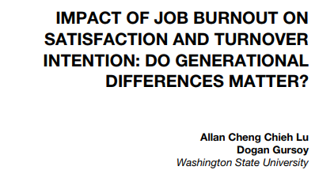
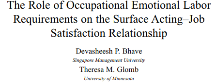
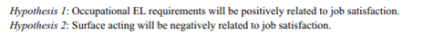

```{r setup, include = FALSE}
# general options --------------------------------------------------------------
options(
  scipen = 999,
  htmltools.preserve.raw = FALSE,
  knitr.kable.NA = " - "
  )
set.seed(42)
# chunk options ----------------------------------------------------------------
knitr::opts_chunk$set(
  cache.extra = knitr::rand_seed, 
  message = FALSE, 
  warning = FALSE, 
  error = FALSE, 
  echo = FALSE,
  cache = FALSE,
  comment = "", 
  fig.align = "center", 
  fig.retina = 3
  )
# libraries --------------------------------------------------------------------
library(tidyverse)
library(knitr)
library(kableExtra)
library(nomnoml)
library(DiagrammeR)
library(ggrepel)
library(fontawesome)
library(tweetrmd)
library(plotly)
library(gapminder)
library(patchwork)
library(webshot2)
library(VennDiagram)
library(countdown)
```

# Previoulsy ...

We have seen how to:

- Extract data from databases with SQL queries
- Clean and Transform data tables with MS Excel
- Visualise data with interactive Tableau dashboards

```{r out.width='80%'}
include_graphics("https://d33wubrfki0l68.cloudfront.net/571b056757d68e6df81a3e3853f54d3c76ad6efc/32d37/diagrams/data-science.png")
```

**It is time to model the data and to perform statistical analyses!**

---

# Why Statistics?

Ask to yourself: *"Why do you do statistics? Why don't scientists just use common sense?"*

The best answer is a really simple one: **we don't trust ourselves enough**, therefore much of statistics is basically a safeguard

Scientific reasoning  requires to engage in **hypothetico-deductive method**:
- Making wise guesses about the relationship between 2 or more variables (also called **Hypothesis**)
- Generalise this results about the world.

Statistical results obtained without the support of an hypothesis beforehand are invalid.

---

# Anatomy of Academic Research Papers

The structure of Academic Research Papers is made to show researchers engaging in this **hypothetico-deductive method**.

1. Introduction

2. Literature Review

3. Method

4. Results

5. Discussion and Conclusion

**What is the purpose of each section in an Academic Research Paper?**

---

# Concept Relationships

Literature Review Section:

```{nomnoml, fig.width=12, fig.height=1.5}
#stroke: black
#direction: right
#align: center
[Variables]->[Hypotheses]

```

Method Section:

```{nomnoml, fig.width=12, fig.height=1.5}
#stroke: black
#direction: right
#align: center
[Hypotheses]->[Model]
[Model]->[Equation]
```

Results Section:

```{nomnoml, fig.width=12, fig.height=1.5}
#stroke: black
#direction: right
#align: center
[Equation]->[Hypotheses]
```

---

# Submitting a Successful Assignment

Write-up a report documenting the results of a systematic quantitative analysis of a dataset with the style of an academic research paper

This will require the use of a statistical software (JAMOVI or any other)

- You will perform a short **Literature Review** presenting your variables and supporting your hypotheses
- You will present a **Method** section describing the variable measurements, the model tested and its corresponding equation
- In the **Results** section, you will run descriptive statistics, including tables and graphics as well as assessing multi-item scale internal reliability (Cronbach’s alpha). The results section will also include a linear regression to test your equations and consequently your hypotheses.
- Finally, your report will include a short **Discussion and Conclusion** section

Individual Assignments should be submitted to loop no later than **June 21st, 2021 by 12pm**

Individual assignment is to be submitted via MT5125’s Loop page

Late assignments are not allowed

---

# Today's Programme

### Part 1: 9am to 12pm

- Mastering Variables, Hypotheses, Models and Equations

### Part 2: 1pm to 1.50pm

- Descriptive Statistics with Jamovi

### Part 3: 2pm to 4pm

- Hypothesis Testing with Jamovi

---
class: inverse, mline, center, middle

# 1. Predictor, outcome and control variables

---

# What is a Variable?

A variable itself is a subtle concept, but basically it comes down to finding some way of **assigning numbers or characters to labels**.

When creating a variable... 

**... Be precise about what you are trying to measure/compare**

**... Determine what method you will use to measure/compare it**

**... Define the set of allowable values that the variable can take**

---

# Categories of Variable

Variables can have different types:

- **Categorical**: If the variable's possibilities are words or sentences (character string)
  - if the possibilities cannot be ordered: Categorical Nominal (*e.g.*, $gender$ male, female, other)
  - if the possibilities can be ordered: Categorical Ordinal (*e.g.*, $size$ S, M, L)
- **Continuous**: If the variable's possibilities are numbers (*e.g.*, $age$, $temperature$, ...) 

> Warning: Variables can be converted to either Categorical and Continuous but it is always better to keep them in their correct scale.

---

# Latent Variables

A questionnaire/survey is made of multiple questions (also called items)

All items that are related to the measurement of a same theoretical construct are constituting a scale.

The theoretical construct measured by the scale is called Latent Variable.

To be analysed a scale has some requirements:

1. All the items must have the same range of possibilities/modalities
2. All the items must correlate together (scale reliability)
3. A unique theoretical construct score has to be calculated from all the items even if it contains subscales.

There are two way to obtain the score of a Latent Variable: 

- Average of all items (reversed if necessary)
- Factor/Component analysis

---

# Latent Variables

Scale to measure the "Perceived Ease-of-use" of Tableau in 4 items were measured from 1 "totally disagree" to 7 "totally agree":

.pull-left[
- q1. I think learning Tableau is easy

- q2. Understanding Tableau is easy

- q3. I am good at using Tableau

- q4. I think using Tableau is easy
]

.pull-right[
```{r}
DiagrammeR::grViz("
digraph rmarkdown {
  graph [rankdir = RL]
  
  node [shape = oval]
  'Perceived Ease-of-use'
  
  node [shape = box]
  q1; q2; q3; q4
  
  'Perceived Ease-of-use'-> {q1 q2 q3 q4}   

}
", height = 200)
```
]

--

Here are the results with 3 students. The score of the "Perceived Ease-of-use" latent variable is calculated using the average of all items.

```{r}
tribble(
  ~employee, ~q1, ~q2, ~q3, ~q4,
  "Sinead",   7,  5,   7,   7,
  "Patrick",   5,  4,   6,   6, 
  "Damien",   3,  1,   2,   3
) %>% 
  rowwise() %>% 
  mutate(peo_score = mean(c(q1, q2, q3, q4))) %>% 
  kable()
```

---

# Validity and Reliability

**Validity = is my variable measuring the construct that I think I am measuring?**
- Does the measurement make sense? 
- Would the results be reproduced with another scale measuring the same latent variable?
- Are the results correlated to latent variables that are related?

Validity test is only performed when a scale is created (no need for existing scales)

**Reliability = consistency of items inside a measurement**
- Test-retest reliability
- Inter-rater reliability
- Correlation inter-item (Cronbach's alpha)

Reliability test is performed every time a scale is used but only using Cronbach's alpha

---

# Validity and Reliability

```{r out.width = "50%"}
knitr::include_graphics("https://www.publichealthnotes.com/wp-content/uploads/2018/08/560px-Reliability_and_validity.svg_.png")
```

---

# Predictors, Outcomes and Controls

It's important to keep the two roles "variable doing the explaining" and "variable being explained" distinct.

Let's denote the:
 - Outcome: "to be explained" variable as Y (also called Dependent Variable or DV)
 - Predictor: "doing the explaining" as X (also called Independent Variable or IV)

Statistics is only about identifying relationship between variables also called **effect**

> An effect between 2 variables mean that the changes in the values of a predictor variable are related to changes in the values of an outcome variable

---

# Predictors, Outcomes and Controls

An effect between a predictor variable $X$ and an outcome variable $Y$ corresponds to the following model:

```{nomnoml, fig.width=12, fig.height=3}
#stroke: black
#direction: right
#align: center

[X]->[Y]
```

To prove this effect, an hypothesis should be formulated and tested:
- "the variable $X$ is explaining the variable $Y$"
- "the variable $X$ influences the variable $Y$"
- "the variable $Y$ is explained by the variable $X$"
- "there is an effect/ a relationship between $X$ and $Y$"

Note, despite having different formulation these hypotheses are all about the same effect suggesting a correlation which is not causation.

---

# Predictors, Outcomes and Controls

## Correlation not Causation

Hypothesis testing evaluates how two or more variable are related or correlated, there is no assumption of one causing the other:

* An "effect" is reciprocal and does not involves causality
* Causality analysis is an other kind of test that involves:
  1. To be sure that 2 variables are correlated
  2. That one variable is the antecedent of the other
  3. That no other variable is explaining this relationship

## Control Variables

They are included in the statistical test but there is no hypothesis about their effect.

They are used to remove an irrelevant explanation of the variable changes.

---
class: title-slide, middle

## Applied Example

---

# Applied Example

I'm the CEO of the IT company D&D which has 1000 employee on 3 different locations. I see many employees who are dissatisfied with their job and I want to understand why. I think it's related to their salary.

My research question is: Does employee's salary have an effect on employee's job satisfaction?

To me this is the case and I'm formulating the following hypothesis: Employee's job satisfaction increases when their salary increases.

In this example:
- Salary is the predictor
- Job Satisfaction is the outcome
- I'm predicting an effect of Salary on Job Satisfaction

```{nomnoml, fig.width=12, fig.height=2}
#stroke: black
#direction: right
#align: center

[Salary]->[Job Satisfaction]
```

---

# Applied Example

To test my hypothesis, I asked as sample of employee to fill out the questionnaire which contains a job satisfaction scale made of 4 items (from 0 to 10) and their salary.

First I need to calculate the score of the job satisfaction latent variable by calculating the average of all questions, then I need to check if salary and job satisfaction share some part of variance and finally if this relationship is reliable enough to be generalised to all employees.

```{r}
tribble(
  ~employee, ~salary, ~q1, ~q2, ~q3, ~q4,
  1,         45000,   1,   5,   3,   2, 
  2,         55000,   5,   4,   6,   6,
  3,         70000,   3,   1,   2,   3,
  4,         80000,   8,   5,   2,   7, 
  5,         95000,   8,   9,   6,   5,
  6,         75000,   3,   1,   2,   1,
  7,         50000,   5,   2,   7,   7, 
  8,         45000,   1,   4,   6,   9,
  9,         65000,   3,   1,   2,   3
) %>% 
  rowwise() %>% 
  mutate(js_score = mean(c(q1, q2, q3, q4))) %>% 
  kable() %>%
  kable_styling(bootstrap_options = "striped", font_size = 15)
```

---
class: title-slide, middle

## Exercise: Inspecting an Academic Research Paper

On the module's Loop page, in the "Additional Content and Links" tile, open the academic research paper "The Role of Occupational Emotional Labor Requirements on the Surface Acting–Job Satisfaction Relationship" by Bhave and Glomb (2013) and:

1. Identify the research question
2. Identify the predictor and outcome variables
3. Identify the hypotheses

```{r}
countdown(minutes = 10, warn_when = 60)
```

---

# Solution

Research questions: All 4 presented page 6 of the document (137 of the academic paper)

Variables: 
- Online Learning Self-Efficacy (OLSE) = Predictor
- Learner–Content Interaction (LCI) = Predictor
- Learner–Instructor Interaction (LII) = Predictor
- Learner-Learner Interaction (LLI) = Predictor
- Student satisfaction within online learning environments = Outcome
- Perceived learning within online learning environments = Outcome

Hypotheses:
- Student satisfaction increases when Online Learning Self-Efficacy (OLSE) increases
- Perceived learning increases when Online Learning Self-Efficacy (OLSE) increases
- Student satisfaction increases when Learner–Content Interaction (LCI) increases
- Perceived learning increases when Learner–Content Interaction (LCI) increases
...

---
class: inverse, mline, center, middle

# 2. How to formulate hypotheses?

---

# Alternative vs. Null Hypotheses

Every hypothesis has to state relationship between variables also called $H_a$ (for alternative hypothesis) or $H_1$

Every hypothesis has a null hypothesis counterpart (no relationship between variables) also called $H_0$ (pronounce H naught or H zero)

$H_a$ is viewed as a “challenger” hypothesis to the null hypothesis $H_0$.
  
**Statistics are used to test the probability of obtaining your results if the Null Hypothesis is true. If this probability is low, then we reject the Null Hypothesis (and consider the Alternative Hypothesis as credible).**

Warning: Hypothesis cannot test equality between groups or modalities, they can only test differences


---

# Hypotheses in a Nutshell

Hypotheses are:

1. Predictions supported by theory/literature
2. Affirmations designed to precisely describe the relationships between variables 

> *“Hypothesis statements contain two or more variables that are measurable or potentially measurable and that specify how the variables are related”* (Kerlinger, 1986)

Hypotheses include:

- Predictor(s) / Independent Variable(s)
- Outcome / Dependent Variable (DV)
- Direction of the outcome if the predictor increases

But there is only two kind of hypotheses: **Main Effect Hypotheses** and **Interaction Effect Hypotheses**

---

# Main Effect Hypothesis

Is the predicted relationship between one predictor and one outcome variable

Effect representation:

```{r eval=TRUE, fig.align="left"}
DiagrammeR::grViz("
  digraph {
    graph [rankdir = LR]
    
    'Predictor' -> 'Outcome'
  }", height = 200)
```

Warning: The direction of the arrow does not involve causality, only correlation.

---

# Main Effect Hypothesis

Its formulation depend on the type of predictor: Continuous or Categorical

--

- If the predictor is Continuous:

.center[The {**outcome**} {*increases/decreases/changes*} when {**predictor**} increases]

> Example: **Job satisfaction** *increases* when **salary** increases

--

- If the predictor is Categorical:

.center[The {**outcome**} of {**predictor's category 1**} is {*higher/lower/different*} than the {**outcome**} of {**predictor's category 2**}]

> Example: **Job satisfaction** of **Irish employees** is *higher* than **job satisfaction** of **French employees**


---

# Main Effect Hypothesis Examples

Variables:

- Outcome = exam results (continuous from 0 to 100)
- Predictor = sleep time (continuous from 0h to 24h)

Effect representation:

```{r eval=TRUE, fig.align="left"}
DiagrammeR::grViz("
  digraph {
    graph [rankdir = LR]
    
    'sleep time' -> 'math exam results'
  }", height = 200)
```

Hypothesis: The **exam results** *increases* when students’ **sleep time** increases

---

# Main Effect Hypothesis Examples

Variables:
- Outcome = exam results (continuous from 0 to 100)
- Predictor = breakfast (categorical *yes* or *no*)

Effect representation:

```{r eval=TRUE, fig.align="left"}
DiagrammeR::grViz("
  digraph {
    graph [rankdir = LR]
    
    'breakfast' -> 'exam results'
  }", height = 200)
```

Hypothesis: **Exam results** of students **who eat breakfast** will be *higher* than **exam results** of students **who do not eat breakfast** 

---

# Main Effect Hypothesis Examples

Variables:
- Outcome = driving errors (continuous from 0 to Inf.)
- Predictor = motorists talking on the phone (categorical *yes* or *no*)

Effect representation:

```{r eval=TRUE, fig.align="left"}
DiagrammeR::grViz("
  digraph {
    graph [rankdir = LR]
    
    'motorists talking on the phone' -> 'driving errors'
  }", height = 200)
```

Hypothesis: **Driving errors** of **motorists who do not talk on the phone while driving** will be *less important* than **driving errors** of **motorists who do not talk on the phone while driving**

---

# Interaction Effect Hypothesis

In simple words ...

```{r out.width="50%"}
tweetrmd::tweet_screenshot(
  tweetrmd::tweet_url("GioraSimchoni", "1255499208670527490"),
  maxwidth = 300,
  hide_media = FALSE,
  theme = "dark"
  )
```

---

# Interaction Effect Hypothesis

It predicts the influence of a second predictor on the relationship between a first predictor and an outcome variable

Notes:

- The second predictor is also called moderator.
- The role of first and second predictors can be inverted with the exact same statistical results

.pull-left[
Effects representation:

```{r}
DiagrammeR::grViz("
  digraph {
    graph [rankdir = LR]
  
    node []
    'Predictor 1'; 'Predictor 2'; Outcome
    node [shape = point, width = 0, height = 0]
    ''
    
    'Predictor 2' -> ''
    'Predictor 1' -> '' [arrowhead = none]
    ''-> Outcome
    
    subgraph {
      rank = same; 'Predictor 2'; '';
    }
  }", height = 200, width = 400)
```
]

.pull-right[

Exactly the same results:
```{r}
DiagrammeR::grViz("
  digraph {
    graph [rankdir = LR]
  
    node []
    'Predictor 1'; 'Predictor 2'; Outcome
    node [shape = point, width = 0, height = 0]
    ''
    
    'Predictor 1' -> ''
    'Predictor 2' -> '' [arrowhead = none]
    ''-> Outcome
    
    subgraph {
      rank = same; 'Predictor 1'; '';
    }
  }", height = 200, width = 400)
```
]

---

# Interaction Effect Hypothesis

.pull-left[
Imagine a first effect where Job Satisfaction increases when Salary increases

```{r fig.height=3.5, fig.width=5}
tribble(
  ~employee, ~salary, ~q1, ~q2, ~q3, ~q4,
  1,         45000,   1,   5,   3,   2, 
  2,         55000,   5,   4,   6,   6,
  3,         70000,   3,   1,   2,   3,
  4,         80000,   8,   5,   2,   7, 
  5,         95000,   8,   9,   6,   5,
  6,         75000,   3,   1,   2,   1,
  7,         50000,   5,   2,   7,   7, 
  8,         45000,   1,   4,   6,   9,
  9,         65000,   3,   1,   2,   3
) %>% 
  rowwise() %>% 
  mutate(js_score = mean(q1, q2, q3, q4)) %>% 
  ggplot(aes(salary, js_score)) +
  geom_point(size = 3) +
  geom_smooth(method = "lm", se = FALSE) +
  scale_y_continuous(limits = c(0, 10)) +
  theme_bw() +
  theme(text = element_text(size = 20))
```
]

.pull-right[
This effect can change according to the values of a second predictor

```{r fig.height=4, fig.width=5}
tribble(
  ~employee, ~salary, ~q1, ~q2, ~q3, ~q4, ~origin,
  1,         45000,   1,   5,   3,   2,   "Irish",
  2,         55000,   5,   4,   6,   6,   "Irish",
  3,         70000,   3,   1,   2,   3,   "Irish",
  4,         80000,   8,   5,   2,   7,   "Irish",
  5,         95000,   8,   9,   6,   5,   "French",
  6,         75000,   3,   1,   2,   1,   "French",
  7,         50000,   5,   2,   7,   7,   "French",
  8,         45000,   1,   4,   6,   9,   "French",
  9,         65000,   3,   1,   2,   3,   "French"
) %>% 
  rowwise() %>% 
  mutate(js_score = mean(q1, q2, q3, q4)) %>% 
  ggplot(aes(salary, js_score, color = origin)) +
  geom_point(size = 3) +
  geom_smooth(method = "lm", se = FALSE, fullrange = TRUE) +
  scale_y_continuous(limits = c(0, 10)) +
  theme_bw() +
  theme(
    text = element_text(size = 20),
    legend.position = "bottom"
    )
```

]

---

# Interaction Effect Hypothesis

The easiest to formulate an interaction effect hypotheses is to imagine the second predictor has two categories even if the it is continuous (e.g., age can be converted to younger vs. older)

Note: this conversion is to help the formulation of the hypothesis but the analysis has to be done with the actual continuous numbers

--

Formulation structure:

.center[The effect of {**predictor 1**} on {**outcome**} is {*higher/lower/different*} for {**predictor's category 1**} than for {**predictor's category 2**}]

Examples: 

> The effect of **Salary** on **Job Satisfaction** is *higher* for **Irish employees** than for **French employees**

> The effect of **Salary** on **Job Satisfaction** is *higher* for **younger employees** than for **older employees**

---

# Interaction Effect Hypothesis Examples

Variables:

- Outcome = exam results (continuous from 0 to 100)
- Predictor 1 = sleep deprivation (categorical low, medium, high)
- Predictor 2 = gender (categorical male vs. female)

Effects representation:

```{r}
DiagrammeR::grViz("
  digraph {
    graph [rankdir = LR]
  
    node []
    'sleep deprivation'; 'exam results'; gender
    node [shape = point, width = 0, height = 0]
    ''
    
    gender -> ''
    'sleep deprivation' -> '' [arrowhead = none]
    ''-> 'exam results'
    
    subgraph {
      rank = same; gender; '';
    }
  }", height = 200)
```

Hypothesis: The effect of sleep deprivation on exam results is higher for Males than for Females

---

# Interaction Effect Hypothesis Examples

Variables:
- Outcome = road accidents (continuous from 0 to Inf.)
- Predictor 1 = alcohol consumption (continuous from 0 to Inf.)
- Predictor 2 = driving experience (categorical low, high)

Effects representation:

```{r eval=TRUE, fig.align="left"}
DiagrammeR::grViz("
  digraph {
    graph [rankdir = LR]
  
    node []
    'alcohol consumption'; 'road accidents'; 'driving experience'
    node [shape = point, width = 0, height = 0]
    ''
    
    'driving experience' -> ''
    'alcohol consumption' -> '' [arrowhead = none]
    ''-> 'road accidents'
    
    subgraph {
      rank = same; 'driving experience' ; '';
    }
  }", height = 200)
```

Hypothesis: The effect of alcohol consumption on road accidents is lower for experienced drivers than for inexperienced drivers

---

# Example of Hypotheses in Research Papers

```{r out.width = "50%"}

```

```{r out.width = "50%"}
knitr::include_graphics("img/ex1_hyp.png")
```

---

# Example of Hypotheses in Research Papers

```{r out.width = "50%"}

```

```{r out.width = "50%"}

```

```{r out.width = "50%"}
knitr::include_graphics("img/ex2_hyp2.png")
```

---

# The Hypothesis Checklist

- Does your hypothesis focus on something that you can actually test?
- Does your hypothesis include both Predictor and Outcome variables?
- Can you manipulate the variables?
- Don't trust research papers, most of them have incorrect formulations

---

# Special Case: Mediation Hypothesis

States that the predicted relationship between a first predictor and an outcome variable is in fact explained by a second predictor

Note: the second predictor is also called mediator

Effect representation:

```{r eval=TRUE}
DiagrammeR::grViz("
  digraph {
    graph [rankdir = LR]
  
    node [shape = circle]
    'Predictor 1'; 'Predictor 2'; Outcome
    
    'Predictor 1' -> {'Predictor 2' Outcome}
    'Predictor 2' -> Outcome

  }", height = 200)
```

---

# Special Case: Mediation Hypothesis

Formulation structure:

.center[The effect of {**predictor 1**} on {**outcome**} is explained by the {**predictor 2**}]

Warning: A mediation effect involves 3 requirements:
1. Predictor 1 needs to have a main effect on the Outcome
2. Predictor 1 needs to have a main effect on the Predictor 2
3. The main effect of Predictor 1 on the Outcome needs to disappear when Predictor 2 is taken into account

> Example: 
- The effect of **employee's age** on **job satisfaction** is explained by their **salary**

> Here, the requirements are:
1. Employee's age needs to have a main effect on job satisfaction
2. Employee's age needs to have a main effect on their salary
3. The main effect of Employee's age on the job satisfaction needs to disappear when salary is taken into account

---

# Mediation Effect Hypothesis Example

Variables:
- Outcome = happiness (continuous from 0 to 7)
- Predictor 1 = grades (continuous from 0 to 100)
- Predictor 2 = self-esteem (continuous from 0 to 7)

```{r eval=TRUE, fig.align="left"}
DiagrammeR::grViz("
  digraph {
    graph [rankdir = LR]
  
    node []
    'self-esteem'; 'grades'; happiness
    
    'grades' -> {happiness 'self-esteem'}
    'self-esteem' -> happiness

  }", height = 200)
```

Hypothesis: the effect of **grades** on **happiness** is explained by **self-esteem**

---
class: title-slide, middle

## Exercise: Find the variables in these hypotheses

In the following hypotheses, find the outcome variable and the predictor(s):

1. Overweight adults who value longevity are more likely than other overweight adults to lose their excess weight

2. Larger animals of the same species expend more energy than smaller animals of the same type.

3. Rainbow trout suffer more lice when water levels are low than other trout.

4. Professors who use a student-centered teaching method will have a greater positive rapport with their graduate students than professors who use a teacher-centered teaching method.

```{r}
countdown(minutes = 3, warn_when = 60)
```

---
class: title-slide, middle

## Exercise: Make your own Hypothesis

|Outcome|Predictor 1|Predictor 2|
|--|---|---|
|Work motivation|Gender(Female/Male)||
|Work motivation|Gender(Female/Male)|Origin(French/Irish)|
|Work motivation|Gender(Female/Male)|Origin(French/Irish/Italians)|
|Job Satisfaction|Stress(from 0 to 10)||
|Job Satisfaction|Stress(from 0 to 10)|Origin(French/Irish)|
|Job Satisfaction|Stress(from 0 to 10)|Age(Millennials/Baby boomers)|
|Job Satisfaction|Stress(from 0 to 10)|Age(in year)|

```{r}
countdown(minutes = 5, warn_when = 60)
```

---
class: inverse, mline, center, middle

# 3. Representing your Model

---

# Structure of Models

Models are graphical representations of theories that highlight hypotheses:
- all the relations correspond to an hypothesis to be tested
- all the tested hypotheses have to be in the model

Distinguish square and circles
- **squares** are actual **measures/items**
- **circles** are **latent variables** related to measures/items

Example:
- *Actual Use* is directly measured (time spend in min) so it's a square.
- *Perceived Usefulness* is a latent variable with several questions so it's a circle.

Items used for latent variables can be omitted in a model, variables are the most important.

We can distinguish 2 types of relationship in a model:
- Main effect relationship
- Interaction effect relationship

---

# Structure of Models

A model is the representation of one ore more effects

.pull-left[
In a model, **a simple arrow is a main effect**

Example:

```{r eval=TRUE}
DiagrammeR::grViz("
digraph rmarkdown {
  graph [rankdir = LR]
  
  node [shape = oval]
  'Intention to Use'; 'Actual Use'
        
  'Intention to Use' -> 'Actual Use'
}
", width = 400, height = 100)
```

It can be read as "Intention to Use has an effect on Actual Use".
]

.pull-right[

In a model, **an arrow crossing another arrow is an interaction effect**

Example:

```{r}
DiagrammeR::grViz("
  digraph {
    graph [rankdir = LR]
  
    node []
    'Intention to Use'; 'Actual Use'; 'Usefulness'
    node [shape = point, width = 0, height = 0]
    ''
    
    'Usefulness' -> ''
    'Intention to Use' -> '' [arrowhead = none]
    ''-> 'Actual Use'
    
    subgraph {
      rank = same; 'Usefulness'; '';
    }
  }", width = 400, height = 100)
```

It can be read as:
- "Intention to Use has a main effect on Actual Use".
- "Usefulness has a main effect on Actual Use".
- "Intention to Use and Usefulness have an interaction effect on Actual Use".

]

---

# Main Effect Relationship

.pull-left[
The relation between one variable and another:

```{r eval=TRUE, fig.align="left"}
DiagrammeR::grViz("
  digraph {
    graph [rankdir = LR]
    node [shape = circle]
    
    X -> Y
  }", height = 200, width = 200)
```

can be read as:
- "X has a **main** effect on Y"
]
.pull-right[
A model can have multiple main effects: 

```{r eval=TRUE}
DiagrammeR::grViz("
  digraph {
    graph [rankdir = LR]
    node [shape = circle]
    
    X -> Y
    Z -> Y
  }", height = 200, width = 200)
```

can be read as: 
- "X has a **main** effect on Y"
- "Z has a **main** effect on Y"
]

---

# Interaction Effect Relationship

The relation between two predictor variables and another outcome variable. An interaction means that **the effect of X on Y will be different according the possibilities of Z** (also called Moderation).

.pull-left[
classic representation:
```{r eval=TRUE}
DiagrammeR::grViz("
  digraph {
    graph [rankdir = LR]
  
    node [shape = circle]
    X; Y; Z
    node [shape = point, width = 0, height = 0]
    ''
    
    Z -> ''
    X -> '' [arrowhead = none]
    ''-> Y
    
    subgraph {
      rank = same; Z; '';
    }
  }", height = 200, width = 300)
```
]

.pull-right[
is the same as:
```{r eval=TRUE}
DiagrammeR::grViz("
  digraph {
    graph [rankdir = LR]
    node [shape = circle]
    
    X -> Y
    Z -> Y
    'X*Z' -> Y
  }", height = 200, width = 200)
```
]

The arrow crossing the main effect arrow can be read as :
- "X have a **main** effect on Y"
- "Z have a **main** effect on Y"
- "X and Z have an **interaction** effect on Y"

---

# Types of Model

## Simple Model

- One or more predictors
- Only one outcome
- Made of main or/and interaction effects

## Mediation Model (simple or moderated)

- At least 2 predictors (one call Mediator)
- Only one outcome
- Made of main effects only for simple mediation / main and interaction effects for moderated mediation

## Structural Equation Model (SEM)

- At least 2 predictors (usually latent variables)
- One or more outcome
- Made of main or/and interaction effects

---

# Simple Model

Simple Models are the most statistically powerful, easy to test and reliable models. Always prefer a simple model compared to a more complicated solution.

Warning, including interaction effect requires a significantly higher sample size (see calculation of power/effect size).

Example:

```{r eval=TRUE}
DiagrammeR::grViz("
  digraph {
    graph [rankdir = LR]
  
    node [shape = circle]
    'Salary'; 'Job Satisfaction'; 'Gender'; 'Age'
    node [shape = point, width = 0, height = 0]
    ''
    
    'Age' -> 'Job Satisfaction'
    'Gender' -> ''
    'Salary' -> '' [arrowhead = none]
    '' -> 'Job Satisfaction'
    
    subgraph {
      rank = same; 'Gender'; '';
    }
    subgraph {
      rank = same; 'Age'; 'Salary';
    }
  }", height = 300, width = 800)
```

---

# Mediation Models

A Mediation model is a complex path analysis between 3 variables, where one of them explains the relationship between the other two. It is usually used to identify cognitive process in psychology.

Example:

```{r eval=TRUE, fig.align="left"}
DiagrammeR::grViz("
  digraph {
    graph [rankdir = LR]
  
    node []
    'self-esteem'; 'math exam results'; happiness
    
    'math exam results' -> {happiness 'self-esteem'}
    'self-esteem' -> happiness

  }", height = 300, width = 800)
```

---

# Structural Equation Model

A Structural Equation Model (SEM) is a complex path analysis between multiple variables including multiple Outcomes and using factor analysis for latent variable estimation.

```{r eval=TRUE}
DiagrammeR::grViz("
digraph rmarkdown {
  graph [rankdir = LR]
  
  node [shape = oval]
  'Perceived Ease-of-use'; 'Perceived Usefulness'; 'Intention to Use'; 'Actual Use'
  
  node [shape = box]
  PU1; PU2; PU3; PU4; PU5; PEOU1; PEOU2; PEOU3; PEOU4; BI1; BI2; AU
  
  {PU1 PU2 PU3 PU4 PU5} -> 'Perceived Usefulness' [arrowhead = none]
  {PEOU1 PEOU2 PEOU3 PEOU4} -> 'Perceived Ease-of-use' [arrowhead = none]
  {BI1 BI2} -> 'Intention to Use' [arrowhead = none]
  {AU} -> 'Actual Use' [arrowhead = none]
  
  'Perceived Usefulness' -> 'Intention to Use'
  'Perceived Ease-of-use' -> {'Perceived Usefulness' 'Intention to Use'}
  'Intention to Use' -> 'Actual Use'
  
  subgraph {
      rank = same; 'Perceived Usefulness'; 'Perceived Ease-of-use';
  }
  
  subgraph {
      rank = same; PU1; PU2; PU3; PU4; PU5; PEOU1; PEOU2; PEOU3; PEOU4; BI1; BI2;
  }

}
", height = 500, width = 800)
```

---

# A Good Model

- Comprehensiveness: Explains a wide range of phenomena
- Internal Consistency: Propositions and assumptions are consistent and fit together in a coherent manner
- Parsimony: Contains only those concepts and assumptions essential for the explanation of a phenomenon
- Testability: Concepts and relational statements are precise.
- Empirical Validity: Holds up when tested in the real world.

Example: 

```{r eval=TRUE}
DiagrammeR::grViz("
digraph rmarkdown {
  graph [rankdir = LR]
  
  node [shape = oval]
  'Perceived Ease-of-use'; 'Perceived Usefulness'; 'Intention to Use'
  
  node [shape = box]
  'Actual Use'
  
  'Perceived Usefulness' -> 'Intention to Use'
  'Perceived Ease-of-use' -> {'Perceived Usefulness' 'Intention to Use'}
  'Intention to Use' -> 'Actual Use'
  
  subgraph {
      rank = same; 'Perceived Usefulness'; 'Perceived Ease-of-use';
  }
}
", height = 300, width = 800)
```

---

# A Bad Theory/Model

- too complicated
- does not explain many things
- cannot be tested

Is it bad?


---
class: title-slide, middle

## Exercise: Draw the Model Used

Draw the model corresponding to these equations:

```{r out.width='80%'}
knitr::include_graphics("img/ex1_hyp.png")
```

```{r}
countdown(minutes = 5, warn_when = 60)
```

---
class: title-slide, middle

## Exercise: Draw the Model Used

Draw the model corresponding to these equations:

```{r out.width='100%'}

knitr::include_graphics("img/ex2_hyp2.png")
```

```{r}
countdown(minutes = 5, warn_when = 60)
```

---
class: inverse, mline, center, middle

# 4. Understanding the Equation

---

# What is a Correlation?

A correlation indicate the strength and direction of a relationship:
- Uses the letter $r$ without statistical tests
- Uses the letter $\beta$ with statistical tests

It has a value between 1 and -1
- 1 indicates a strong and positive relationship
- -1 indicates a strong and negative relationship
- 0 indicates no relationship

---

# What is a Correlation?

```{r out.width='100%'}

```

---

# Evaluation of the Significance

Once all the hypotheses are formulated, it is time to test all of them in one unique model. In this model, a value called $\beta$ which is usually the coefficient of correlation is associated to each predictor from the hypotheses. 

Testing for the significance of the effect means evaluating if this $\beta$ value is significantly different, higher or lower than 0 (no link between variables):

- $H_a: \beta \neq 0$ means our hypothesis doesn't precise the direction of the change, just that there is a change

- $H_a: \beta > 0$ means our hypothesis indicates that the relationship increases or a group is higher than another group

- $H_a: \beta < 0$ means our hypothesis indicates that the relationship decreases or a group is lower than another group

- The Null hypothesis will always be $H_0: \beta = 0$

---

# A Basic Equation

The basic structure of a statistical model is:

$$Outcome = Model + Error$$

where the $Model$ is a series of predictors that are expressed in hypotheses.

This expresses the idea that the Outcome can be described by a statistical model, which expresses what we expect to occur in the Outcome, along with the difference between the model and the Outcome, which we refer to as the error.

---

# A Basic Equation

```{r}
df <- 
  data.frame(
    Observation = letters[1:11],
    Outcome = 10:0, 
    Predictor = 10:0
  ) 
```


Let's imagine the perfect scenario: **your predictor Predictor variable explains perfectly the outcome variable**.

The corresponding equation is: $Outcome = Predictor$

.pull-left[
```{r}
df %>% 
  kable(align = "ccc") %>%
  kable_styling(bootstrap_options = "striped", font_size = 14)
```
]
.pull-right[
```{r fig.height=7}
df %>% 
  ggplot(aes(Predictor, Outcome, label = Observation)) +
  geom_point(color = "black", size = 5) +
  geom_smooth(method = "lm") +
  scale_x_continuous(limits = c(0,10)) +
  scale_y_continuous(limits = c(0,10)) +
  theme_bw() +
  theme(text = element_text(size = 20))
```
]

---

# A Basic Equation

In the equation $Outcome = Predictor$, three coefficients are hidden because they are unused:
- the **intercept coefficient** $\beta_{0}$ (i.e., the value of the Outcome when the Predictor = 0) which is 0 in our case
- the **slope coefficient** $\beta_{1}$  (i.e., how much the Outcome increases when the Predictor increases by 1) which is 1 in our case
- the **error coefficient** $\epsilon$ (i.e., how far from the prediction line the values of the Outcome are) which is 0 in our case

So in general, the relation between a predictor and an outcome can be written as:
$$Outcome = \beta_{0} + \beta_{1} * Predictor + \epsilon$$

which is in our case:

$$Outcome = 0 + 1 * Predictor + 0$$

---

# A Basic Equation

The equation $Outcome = \beta_{0} + \beta_{1} * Predictor + \epsilon$ is the same as the good old $y = ax + b$ (here ordered as $y = b + ax$) where $\beta_{0}$ is $b$ and $\beta_{1}$ is $a$.

It is very important to know that under **EVERY** statistical test, a similar equation is used (t-test, ANOVA, Chi-square are all linear regressions).

```{r fig.width=5.5, fig.height=5.5, fig.align='center'}
plot0 <- data.frame(Predictor = 0:10, Outcome = 0:10) %>%
  ggplot(aes(Predictor, Outcome)) +
  geom_point(color = "black", size = 5) +
  geom_smooth(method = "lm") +
  geom_hline(yintercept = 0, color = 'black', size = 0.5, linetype = 'dotted') +
  annotate("text", x = 5, y = 0.2, label = "Intercept \u03b2\u2080") +
  annotate('segment', x = 5, xend = 6, y = 5, yend = 5, color = 'red') +
  annotate('segment', x = 6, xend = 6, y = 5, yend = 6, color = 'red') +
  annotate("text", x = 7.5, y = 5.5, label = "Slope \u03b2\u2081") +
  scale_x_continuous(breaks = seq(0:10)) +
  scale_y_continuous(breaks = seq(0:10)) +
  theme_bw()

plotly::ggplotly(plot0)
```

---

# Equations, Variables and Effect Types

Except in special cases:
- An Outcome (or Dependent Variable) has to be Continuous
- A Predictor can be Continuous or Categorical 

Example: $Job\,Satisfaction = \beta_{0} + \beta_{1}.Salary + \beta_{2}.Origin + \epsilon$

In this equation:
- $Salary$ is continuous with a main effect on $Job\,Satisfaction$ ( $\beta_{1}$)
- $Origin$ is categorical with a main effect on $Job\,Satisfaction$ ( $\beta_{2}$) 

An interaction effect is represented by multiplying the 2 predictors involved:

$$Job\,Satisfaction = \beta_{0} + \beta_{1}.Salary + \beta_{2}.Origin + \beta_{3}.Salary*Origin + \epsilon$$

In this equation:
- $Salary$ is continuous with a main effect on $Job\,Satisfaction$ ( $\beta_{1}$)
- $Origin$ is categorical with a main effect on $Job\,Satisfaction$ ( $\beta_{2}$)
- $Salary$ and $Origin$ have an interaction effect on $Job\,Satisfaction$ ( $\beta_{3}$)

---

# Relevance of the Intercept

To test hypotheses, only the $\beta$ values associated to Predictors / Independent Variables are important.

The intercept is always included in an equation but its result is useless for hypothesis testing.

Let's see why the intercept is always included but its results discarded.

Imagine we want to test the relationship between GDP per Capita and Life Expectancy of countries in the world. Let's compare a model without and a model with intercept:

- Without intercept: $Life\,Expectancy = \beta_{1}.GDP\,per\,Capita + \epsilon$

- With intercept: $Life\,Expectancy = \beta_{0} + \beta_{1}.GDP\,per\,Capita + \epsilon$

---

# Relevance of the Intercept

```{r}
p1 <- gapminder %>% 
  filter(year == 2007) %>% 
  ggplot(aes(x = gdpPercap, y = lifeExp)) +
  geom_point() +
  scale_y_continuous(limits = c(0, 90)) +
  labs(
    title = "A: Original Data",
    x = "GDP per Capita ($)",
    y = "Life Expectancy"
  )

p2 <- gapminder %>% 
  filter(year == 2007) %>% 
  ggplot(aes(x = gdpPercap, y = lifeExp)) +
  geom_point() +
  geom_smooth(method = lm, se = FALSE, fullrange = TRUE, formula = "y ~ x + 0 ") +
  scale_y_continuous(limits = c(0, 90)) +
  labs(
    title = "B: Model without intercept",
    x = "GDP per Capita ($)",
    y = "Life Expectancy"
  )

p3 <- gapminder %>% 
  filter(year == 2007) %>% 
  ggplot(aes(x = gdpPercap, y = lifeExp)) +
  geom_point() +
  geom_smooth(method = lm, se = FALSE, fullrange = TRUE, formula = "y ~ x") +
  scale_y_continuous(limits = c(0, 90)) +
  labs(
    title = "C: Model with intercept",
    x = "GDP per Capita ($)",
    y = "Life Expectancy"
  )

p1 / (p2 + p3)
```

If the intercept is not included, the intercept is zero and can lead to estimation errors

---
class: title-slide, middle

## Exercise: Predicates of Statistical Analyses

Find variables, formulate hypotheses, draw model, and write equation corresponding to the following data

---

# Data 1

Find variables, formulate hypotheses, draw model, and write equation corresponding to the following data

.pull-left[

.center[Data]

```{r}
  data.frame(
    participant = c("ppt1", "ppt2", "ppt3", "ppt4", "ppt5", "ppt6"), 
    IQ = c(120, 103, 96, 87, 114, 95),
    math_results = c(89, 64, 71, 77, 78, 69)
  ) %>% 
  kable()
```
]
.pull-right[

.center[Visualisation]

```{r fig.height=6}
  data.frame(
    participant = c("ppt1", "ppt2", "ppt3", "ppt4", "ppt5", "ppt6"), 
    IQ = c(120, 103, 96, 87, 114, 95),
    exam_mark = c(89, 64, 71, 77, 78, 69)
  ) %>% 
  ggplot(aes(x = IQ, y = exam_mark, label = participant)) +
  geom_point(color = "black", size = 5) +
  geom_text_repel(size = 10) +
  theme_bw() +
  theme(
    text = element_text(size = 20)
  )
```
]

```{r}
countdown(minutes = 5, warn_when = 60, right =  1)
```

---

# Data 1

Variables:
- Outcome = exam_mark (from 0 to 100)
- Predictor = IQ (from 0 to Inf.)

Hypothesis:
- $H_a$: The **exam_mark** *increases* when **IQ** increases
- $H_0$: The **exam_mark** *stay the same* when **IQ** increases

Model:
```{r eval=TRUE, fig.align="center"}
DiagrammeR::grViz("
  digraph {
    graph [rankdir = LR]
    node [shape = circle]
    
    IQ -> exam_mark [label= β1]
  }", height = 100, width = 500)
```

Equation:
- $exam\_mark = \beta_{0} + \beta_{1}.IQ + \epsilon$

---

# Data 2

.pull-left[

.center[Data]

```{r, eval=TRUE}
df4 <- data.frame(
  participant = c("ppt1", "ppt2", "ppt3", "ppt4", "ppt5", "ppt6"), 
  IQ = c(120, 103, 96, 87, 114, 95),
  age = c(50, 60, 70, 20, 30, 40),
  exam_mark = c(89, 64, 71, 77, 52, 69),
  age_c = c("experienced", "experienced", "experienced", "beginner", "beginner", "beginner")
)

df4 %>% 
  select(-age_c) %>% 
  kable()
```
]
.pull-right[

.center[Visualisation]

```{r fig.height=6}
df4 %>% 
  ggplot(aes(x = IQ, y = exam_mark, color = age_c)) +
  geom_point(size = 5) +
  geom_smooth(method = "lm", se = FALSE, fullrange = TRUE) +
  theme_bw() +
  theme(
    text = element_text(size = 14)
  )
```
]

```{r}
countdown(minutes = 5, warn_when = 60, right =  1)
```

---

# Data 2

Variables:
- Outcome = exam_mark (from 0 to 100)
- Predictor 1 = IQ (from 0 to Inf.)
- Predictor 2 = age (from 0 to Inf. but categorised for visualisation)

Hypotheses: 
- $H_{a_{1}}$: The **exam_mark** *increases* when **IQ** increases
- $H_{0_{1}}$: The **exam_mark** *stay the same* when **IQ** increases

- $H_{a_{2}}$: The **exam_mark** *increases* when **age** increases
- $H_{0_{2}}$: The **exam_mark** *stay the same* when **age** increases

- $H_{a_{3}}$: The effect of **IQ** on **exam_mark** is *higher* for **beginner** than for **experienced students**
- $H_{0_{3}}$: The effect of **IQ** on **exam_mark** is *the same* for **beginner** than for **experienced students**

---

# Data 2

Model:

.pull-left[

.center[Classic Representation]
```{r eval=TRUE}
DiagrammeR::grViz("
  digraph {
    graph [rankdir = LR]
  
    node [shape = circle]
    IQ; exam_mark; age
    node [shape = point, width = 0, height = 0]
    ''
    
    age -> ''
    IQ -> '' [arrowhead = none]
    ''-> exam_mark
    
    subgraph {
      rank = same; age; '';
    }
  }", height = 300, width = 400)
```
]

.pull-right[

.center[Effects Correspondance]
```{r eval=TRUE}
DiagrammeR::grViz("
  digraph {
    graph [rankdir = LR]
  
    node [shape = circle]
    IQ; exam_mark;'IQ*age'; age

    age -> exam_mark [label= β2]
    IQ -> exam_mark [label= β1]
    'IQ*age' -> exam_mark [label= β3]
    
  }", height = 300, width = 300)
```
]

Equations:

- $exam\_mark = \beta_{0} + \beta_{1}.IQ + \beta_{2}.age + \beta_{3}.interaction + \epsilon$

which corresponds to: $exam\_mark = \beta_{0} + \beta_{1}.IQ + \beta_{2}.age + \beta_{3}.IQ*age + \epsilon$ 

---
class: inverse, mline, left, middle


# Thanks for your attention and don't hesitate if you have any question!

[`r fontawesome::fa(name = "twitter")` @damien_dupre](http://twitter.com/damien_dupre)  
[`r fontawesome::fa(name = "github")` @damien-dupre](http://github.com/damien-dupre)  
[`r fontawesome::fa(name = "link")` damien-datasci-blog.netlify.app](https://damien-datasci-blog.netlify.app)  
[`r fontawesome::fa(name = "paper-plane")` damien.dupre@dcu.ie](mailto:damien.dupre@dcu.ie)